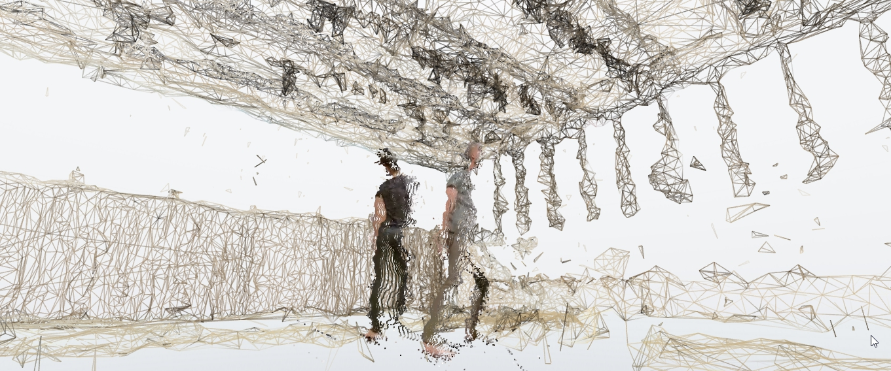

Andrej Boleslavský is an independent artist who applies technology in the field of new media art, interactive design, physical computing and 3D printing. His work reflects strong fascination with combining nature with technology. 

===

/Also check out Sensorium [Machine Learning for Artists and Designers workshop](http://sensorium.is/workshops/machine-learning)\

He’s created many interactive installations and lectures about open source software and programming platforms like VVVV and Arduino. He often cooperates on his projects with artist [Mária Judová](www.mariajudova.net).
 
We talked with [Andrej](http://id144.org ) about his experience being part of an intensive week-long workshop with Gene Kogan in Italy. Together they created the [Invisible Cities](https://opendot.github.io/ml4a-invisible-cities/) project. They trained neural network to translate parts of a map to generative satellite pictures.
 
 
 
Did you know Gene before the workshop?
 
I met [Gene](http://www.sensorium.is/speakers/gene-kogan) during my joint exhibition with Mária in India two year ago. That was also the moment where I was introduced to his work. The pieces he brought there weren’t exactly machine learning though. It was more of an interactive kinetic installation.
 
What was your motivation for joining the workshop?
 

Studio [Opendot](http://www.opendotlab.it/) started organizing a whole series of workshops. I gave a two days workshop about kinect, then [Eliot Woods](http://www.kimchiandchips.com/) gave a week workshop about the tool Rulr, which he created. Then they invited Gene to run a workshop about Machine learning. It was a huge success. With 25 people participating it was almost overcrowded although the fee was around 300 or 400 euros. The workshop lasted for 5 days and every day started with a lecture by Gene. He talked about machine learning, commenting on its political, philosophical and aesthetic impacts. He often mentioned also the ethical perspective. This topic was very appealing to me.
 
I was interested in the workshop as a creator and technologist who sometimes makes a living by creating technological solutions. For my work it is crucial to keep learning new things. And machine learning technologies are something different from what I usually do. I took the opportunity and came equipped with my own desktop PC. Running on Linux with quite strong graphic card I could start working on it right away. Before the workshop I had already tried deepdream and similar published algorithms. So I was aware that strong and powerful computer is necessary if you want to have fun.
 
Could you tell us something about Opendot studio?
 
I met people from Opendot studio in person while doing a residency there two years ago. I can tell they are a very interesting group. It is a design studio with its own maker space for creative exchange. People from the studio work in the maker space and people from the maker space very often help out with the projects in the creative studio. Another interesting thing about Opendot is that I see them as a next step for maker spaces. They are focusing on application of the computer manufacturing in design. Whether it’s graphic design or product design, they have different kinds of applied products.
 

 
What practical skills or methods have you learned at the workshop?
 
Gene covered quite a wide spectrum of technologies. Self learning frameworks for machine learning and also we got to practice Python a lot.
 
Were all participants familiar with programming?
 
Well, it was actually a variety of people with many different professions. There were designers, architects or people creating maps. Also there were a few programmers and people actually working with machine learning. For example a some of the Italian guys were machine learning focused start ups. One of the participants worked on affective computing, a field that focuses on recognizing the emotional state of a person. Another participant belonged to the Opendot FabLab staff.
 
What was the process of the workshop?
 
Gene had about 5 or 6 lectures, one of them was publicly accessible. We were divided into smaller groups depending on the project we wanted to work on according to individual presentation of ideas.

It was definitely challenging– especially on the technological level. Apart from the frameworks itself I got to practice working with Linux which I don’t usually use. I also learned how to install some things, for example Docker and similar things. Many of those need to be programmed but with us using and bending existing solutions it wasn’t as hard. The installations themselves were definitely the most difficult part.

 
Do you use the actual knowledge gained at workshop?
 
I had big plans, but then we got stuck in the creation of [Dust](http://www.vrdust.org.uk) (an immersive VR experience) which doesn’t use machine learning. Even though though it could.

Machine learning has interesting applications almost in everything. That is because it extends the capability of computers to fields that used to be restricted to humans. Computers are actually starting to have abilities that we never thought they could have. The complexity grows very fast. Machines are not only much faster, but also extremely sophisticated.

  Dust
 
What fascinates you about machine learning?
 
The change in paradigm of programming or in creative solutions in machine learning is very appealing to me. The programming itself started with a punch card, where you put in a code. The code is everything the program consists of and it fully belongs to you.

But with machine learning you download one framework, then you download for example a trained model, some environment. Suddenly you hold something in your hands that thousands of people participated. You’re adjusting some part and suddenly something magical has been created. That’s why machine learning reminds me of magic even though there is nothing magical about it. It is just an algorithm. By millions of trivial things joining together the actual magic is created.
 
How did you enjoy the way Gene was teaching his workshop?  What were your feelings about it?
 
It was fantastic! It definitely was the most essential workshop I participated in during  last year. Machine Learning is a field that gets a lot of media attention and at the same time completely new to me. It was very energizing to see the drive of the participants trying to absorb everything. Gene’s presentations were very well prepared. He wrote everything in OpenFrameworks and the slides were interactive. His explanations were clear and easy to understand. He can get as deep as the audience wishes to and needs to. He gives great lectures and manages to explain things to beginners while at the same time teaching people owning a machine learning company. Not to forget he is a very nice person on the human level too! Never arrogant, although he is currently the most respected person in machine learning in the context of art. 

Credits - pictures: Andrej Boleslavský, Gene Kogan, Gabriele Gambotto, Ambhika Samsen, Michele Ferretti, Damiano Gui, Fabian Frei

