****[CAN ](https://www.creativeapplications.net) Article: The Augmented Mind and Where to Look For It****

[Originally published on CreativeApplications.Net on 7.5.2019](https://www.creativeapplications.net/events/sensorium-festival-2019/)

In anticipation of the 2019 edition of Bratislava’s Sensorium Festival (June 7-9), head curator Philo van Kemenade shares inspiration and research notes that shaped this year’s theme “The Augmented Mind”.

I’m walking through an unknown, yet strangely familiar city. My ears meet voices they don’t comprehend. Buildings wear street signs written in a script I can’t read. My attention is heightened, I look at the world around me through a new set of eyes. It’s April 2015 and I’m in Belgrade, Serbia’s charismatic capital, to attend Resonate Festival. For the past three days, I participated in a workshop led by James George and Alexander Porter. We used photogrammetry to capture parts of the city in digital 3D and, inspired by the early 20th Century surrealist Exquisite Corpse parlor game, stitched them together in a collaborative assemblage. The result is exhilarating beyond the imaginary neighborhood we created: for weeks after the workshop, I walked through my own neighbourhood, wondering how objects would turn out if I’d submit them to my newly acquired 3D scanning skill. The plaza fountain is no longer just a place to sit down, but a shape to be captured and creatively manipulated in a series of representations – from photos to point clouds to vertices, edges, and faces. I really felt that I gained an extra sense that imbues my surroundings with new levels of meaning.

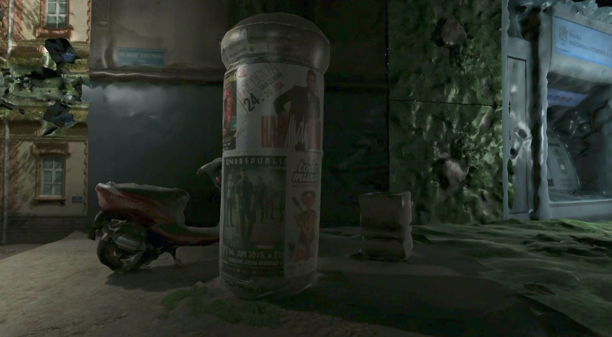

_↑ Collaborative 3D drawing of an imaginary neighborhood: a detail of the interactive urban landscape produced during James George and Alexander Porter’s “Exquisite City” photogrammetry workshop. Notice the exquisite use of a building-sized ATM._

**Magic enhancement**

The enhancement of my lived experience by a combination of practical skill, technical understanding and ready access to hardware, feels magical. Not in a mystifying sense, but rather in a way that is enriching and empowering. Why doesn’t our experience with digital technology feel like this more often? What if we explicitly aim for the extension of human capabilities when we design products or experiences? What role can creative fields like art, design, and science play in such an endeavour? I’ve been thinking about this a lot lately, and I felt inspired to explore these topics with this year’s edition of Sensorium, an annual festival in Bratislava, Slovakia, that I curate together with director Lucia Dubačová. Themed “The Augmented Mind,” Sensorium 2019 will bring together a community of creative practitioners, researchers, and technologists to explore augmentation as a creative principle.

## “For me, augmentation is about learning more about the universe. Galileo took the telescope and looked at the skies and confirmed what Copernicus had said. […] After seeing that you cannot be the same. That’s what I’m most excited about: technology allowing us to see things.”
## 
## – Memo Akten (during a recent conversation at Muovo Festival, Prague)

**Augmenting Human Intellect**

For our theme “The Augmented Mind,” we are building on a great deal of ideas, past and present. Particularly inspiring is the work of American engineer, inventor, and early computer pioneer Douglas Engelbart (1925-2013), who made it his life purpose to invent ways to efficiently harness collective intelligence. In his 1962 manifesto “Augmenting Human Intellect: A Conceptual Framework,” he envisioned computing as the basis for interactive systems that can enhance the capabilities of a globally connected society in real-time.

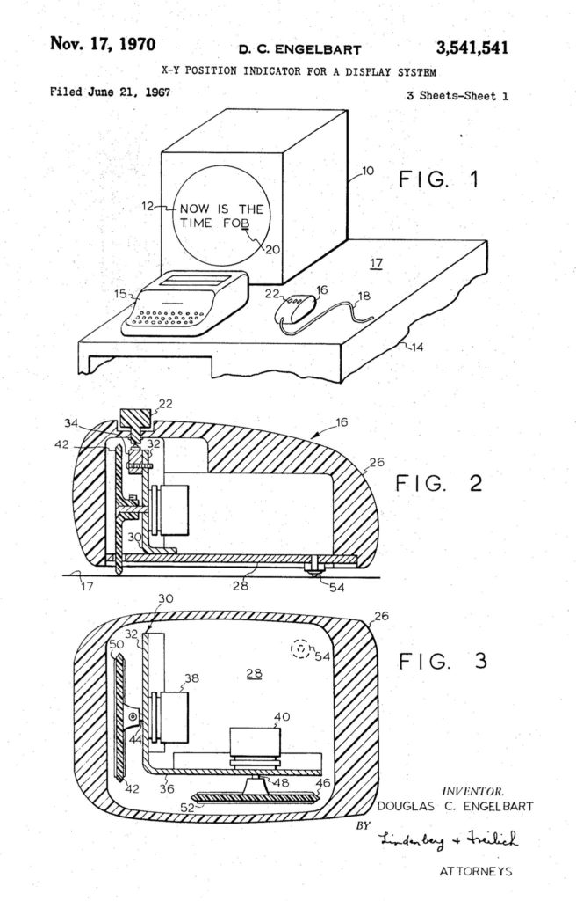

_One of the instruments invented to facilitate interactive computing. Also: round monitors._

In December 1968, Engelbart and his team presented the now famous “Mother of All Demos” at the Fall Joint Computer Conference in San Francisco, California. The demonstration showcased their oN-Line System (NLS) featuring windowed GUIs, structured word processing, hypertext, networked video conferencing, and collaborative document editing. These innovations were socio-technical instruments to approach the vision of a new, augmented way of thinking together, facilitated by interactive computing. What Engelbart is most remembered for however, is the invention of the computer mouse. While a critical achievement, celebrating him for it alone would be missing the point. “This is as if you found the person who invented writing, and credited them for inventing the pencil,” remarked famed computer engineer and interface designer Bret Victor in his Engelbart eulogy.

Engelbart’s long-term impact was perhaps most strongly enabled by his realisation that solving important problems requires the efficient collaboration of people thinking together. It led to his life-long mission of advancing the collective problem solving capabilities of a globally connected society, faced with issues of ever increasing complexity and urgency.

**Looking for augmentation in all the mind’s places**

At this year’s edition of Sensorium, we’d like to explore how Engelbart’s pursuit of the “Augmented Human Intellect” is channelled – and advanced – in contemporary practice. The idea that our intellect extends beyond our brain, for example, has slowly been gaining ground in cognitive science. Within philosophy of mind, the theory of ‘situated cognition’ posits that people’s thinking is inseparable from the context in which it happens. This context spans several dimensions and enables us to think of the mind as enactive, embodied, embedded and extended. With “The Augmented Mind” we aim to shine light on each of these aspects.

## “Consciousness is not something that happens inside us. It is something we do or make. Better: it is something we achieve. Consciousness is more like dancing than it is like digestion.”
## 
## – Alva Noë, Out of Our Heads (2010)

**The mind augmented by engagement with the world**

While most cognitive scientists continue to look for consciousness in the brain, more and more researchers are starting to search elsewhere. In his book Out of Our Heads (2010), for example, American philosopher Alva Noë describes consciousness as ‘enactive’ and brought about in active engagement with the world: “Consciousness is not something that happens inside us. It is something we do or make. Better: it is something we achieve. Consciousness is more like dancing than it is like digestion.” To explore how our thinking is shaped by our engagement with the world, we welcome festival goers to sign up for the Augmented Attention Lab, a 3-day workshop where participants prototype wearables, protheses, and portable tools, that augment the body in order to sense environmental changes happening at the threshold of the human perception. Facilitated by The Hague-based artists Sissel Marie Tonn and Jonathan Reus, the lab draws on both artists’ on-going research project Sensory Cartographies.

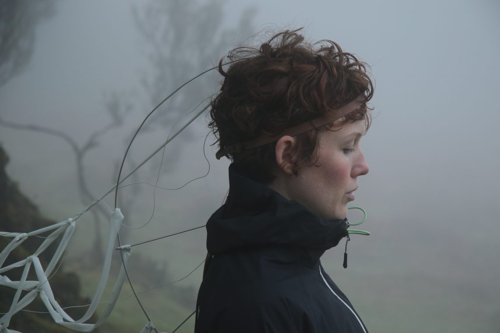

_Sissel Marie Tonn and Jonathan Reus’ Augmented Attention Lab (a 3-day workshop) builds on the artists’ ongoing research project Sensory Cartographies_

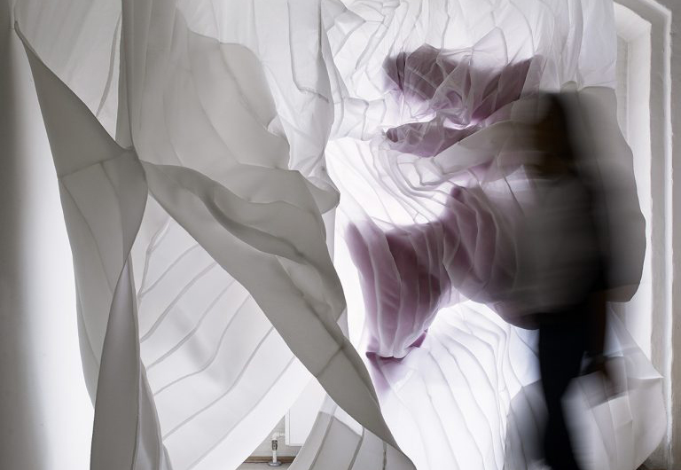

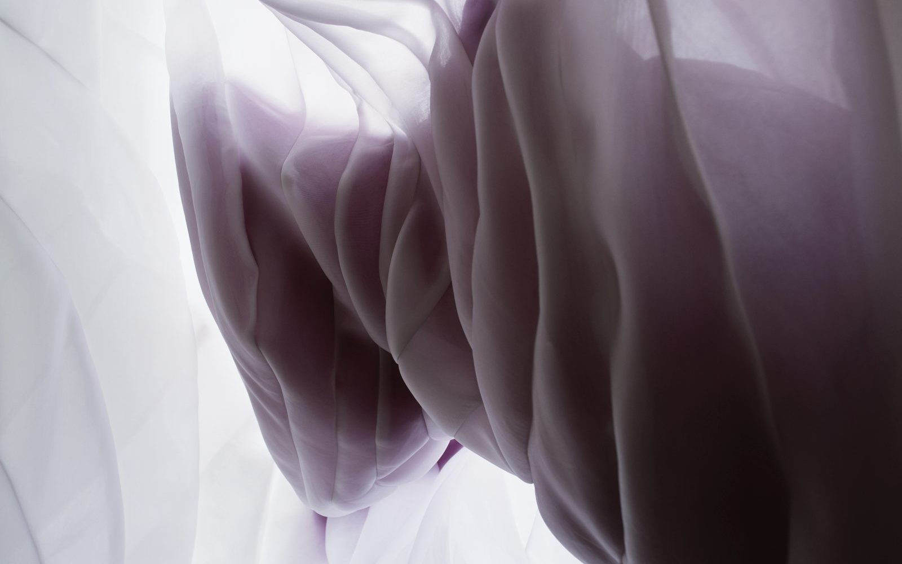

_ Sensorium speaker Danica Pistekova’s textile work explores the human body and architectural space_

**The mind augmented by the body**

Embodied cognition holds that our physical make-up has a causal effect on our mental states. In other words: we think with our bodies – at least partially. Besides getting hands-on during the Augmented Attention Lab, we are also honoured to welcome genre-bending innovators whose practice centres around the human body at our conference program. Slovak designer and architect Danica Pistekova examines corporeality and architectural space. Her work deals with contrasting aspects of the rigid and the flexible, the ephemeral and the perpetual, the intuitive and the logical; it speculates how textiles can mediate these in-between spaces.

**The mind augmented by external tools**

But why stop at the boundaries of skin and skull? In their seminal 1998 work The Extended Mind, American philosophers Andy Clark and David Chalmers argue that our cognition is extended by our environment and the tools that help us think and create. Their idea of “active externalism” explains cases where “the human organism is linked with an external entity in a two-way interaction, creating a coupled system that can be seen as a cognitive system in its own right. All the components in the system play an active causal role, and they jointly govern behaviour in the same sort of way that cognition usually does. If we remove the external component the system’s behavioural competence will drop, just as it would if we removed part of its brain. Our thesis is that this sort of coupled process counts equally well as a cognitive process, whether or not it is wholly in the head.”

## “All the components in the system play an active causal role, and they jointly govern behaviour in the same sort of way that cognition usually does. If we remove the external component the system’s behavioural competence will drop, just as it would if we removed part of its brain.”
## 
## – Andy Clark and David Chalmers, The Extended Mind (1998)

Just like Engelbart’s team bootstrapped its inventions by consistently using them in their daily work, many designers, artists, and makers abstract parts of their work into reusable tools. These function as extensions of their creative process, but in many cases also augment the work of others in the form of toolkits and open-source code. At this year’s Sensorium, we are honoured to welcome such pioneering artist tool-maker types: Elliot Woods is one half of Kimchi and Chips, a Seoul-based artist studio he runs together with Mimi Son. Exploring reality and representation through artistic research and engineering, the two are best known for their work with volumetric images and 3D projection. Halo (2018), for example, was a site-specific installation at London’s Somerset House that sculpted sunlight into an immaterial form through mist and a matrix of computer-controlled mirrors. A physicist by training, Elliot has contributed extensively to the openFrameworks and vvvv creative coding platforms; he is also the author of Rulr, an open-source toolkit for calibrating spatial technologies such as cameras, projectors, and Kinects. Cris Valenzuela, another Sensorium guest, is a technologist, artist and software developer based in New York City, working at the intersection of artificial intelligence and creative tools. He is the creator of Runway, a tool to allows creators to use state-of-the-art machine learning models in an intuitive way. Elliot and Cris will both speak at Sensorium; Cris will also lead a 1-day Runway workshop.

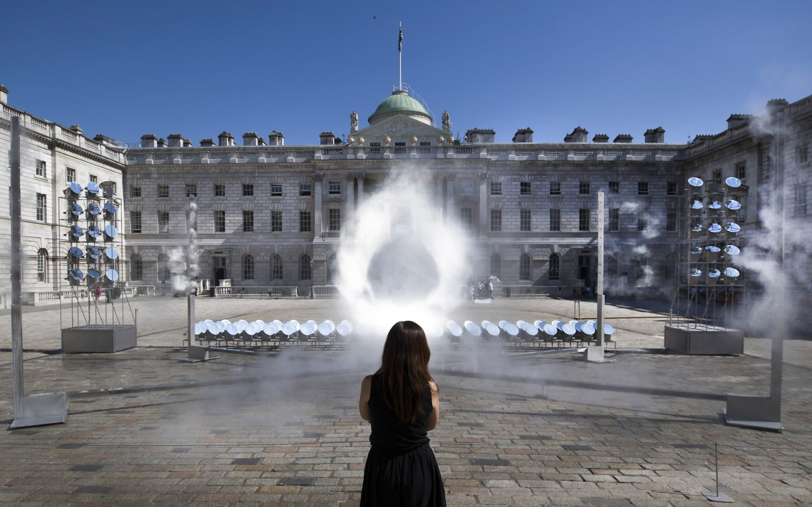

_Kimchi and Chips’ site-specific installation Halo (2018) at Somerset House London_

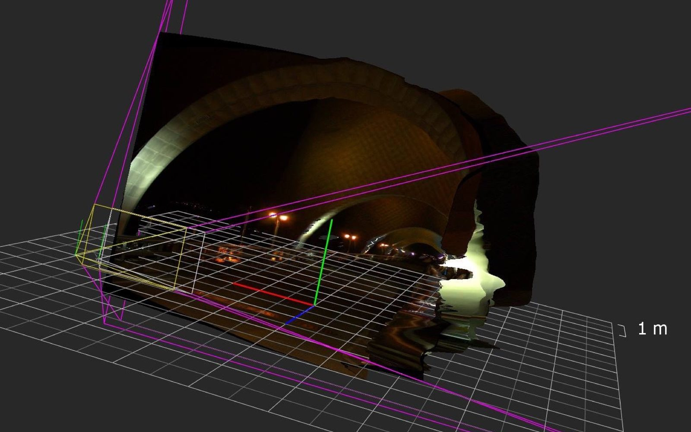

_Powerful tools made by Sensorium speakers: Rulr by Kimchi and Chips’ Elliot Woods is an open tool for calibrating spatial media devices_

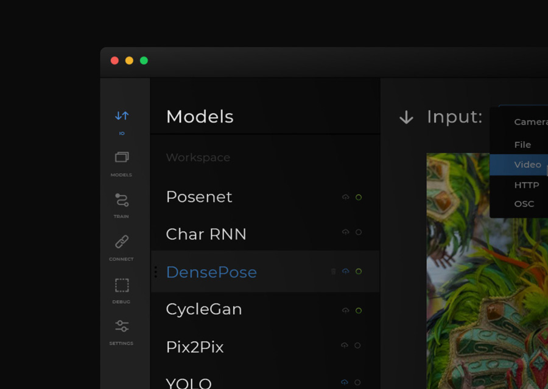

_Runway by Cris Valenzuela augments creativity by making machine learning more accessible and intuitive._

**The mind augmented by culture and sociality**

As social creatures we rely on others to flourish in the world. It is our interactions with other people that enable us to learn, understand, and operate as realised human beings. As the World Wide Web ages, we are slowly coming to grips with the ways in which our social contexts are increasingly entangled in socio-technical systems.

In the lead-up to the festival, we are proud to host Augmented Authorship, a Slovak Design Centre exhibition at Satelit Gallery featuring a selection of works by London-based artist and designer Matthew Plummer Fernandez. Matthew’s work investigates collective forms of authorship under the influence of computational processes and automated (re)assembly. On view are his early forays into algorithmically manipulated sculptures, 3D prints of the auto-generated assemblages from the Shiv Integer project (2016-17) as well as as copy of Every Mickey (2017) – a sculpture of every 3D model of Mickey Mouse found online, compiled as one. As part of the exhibition, we invite young people to create their own placards to be added to protests in augmented reality that can be staged anywhere via Matthew’s recent Echo Youth project. The exhibition opened on April 10th and will be on view through Sensorium Festival.

_These selected works are on view during Sensorium Festival as part of the exhibition Augmented Authorship at Bratislava’s Satelit Gallery_

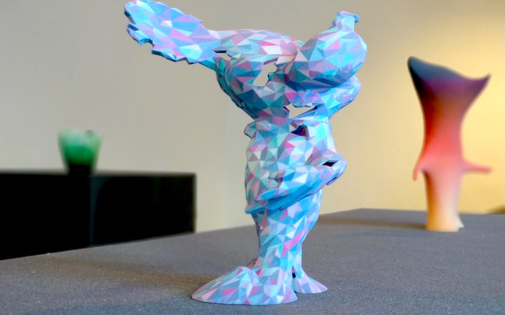

_sekuMoi Mecy by Matthew Plummer Fernandez_

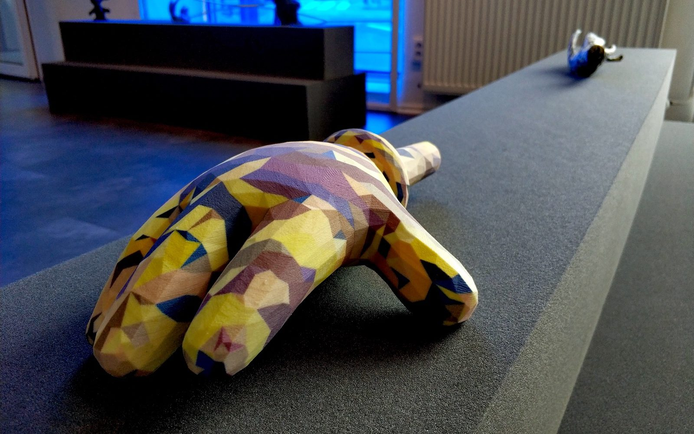

_Hand-fixed by Matthew Plummer Fernandez_

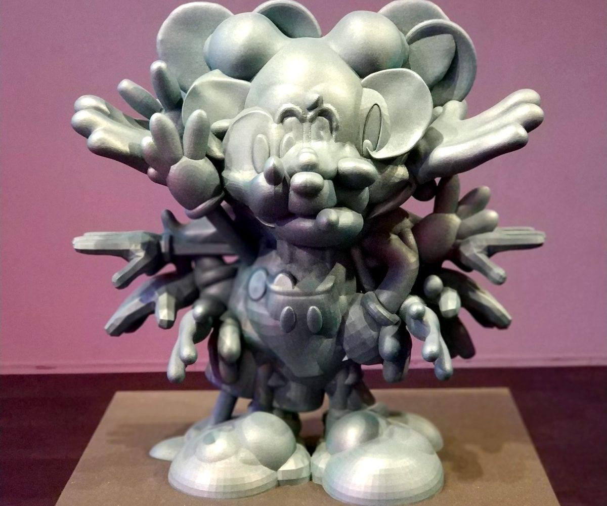

_Every Mickey by Matthew Plummer Fernandez_

In closing: the Sensorium program has never been richer and more diverse. Other highlights include talks by data visualization authority Stefanie Posavec, artist and designer Chris Csíkszentmihályi, futurist and philosopher Aleksandra Przegalinska as well as several performances by Cod.Acts’ uncanny robot installation πTon (2017). I hope this slice through the program – and our thinking behind it – explains our excitement about this edition. More importantly, I hope that the rumination on “The Augmented Mind” will spark timely conversations about the role of computation in our lives, communities, and in society at large. I’m looking forward to continuing the discussion both at the festival and beyond.