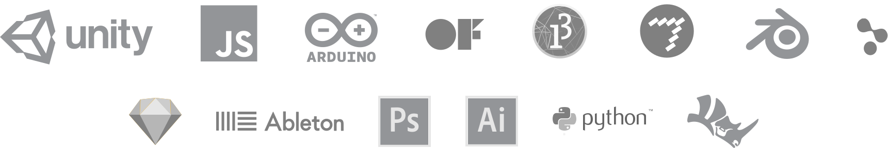

### Sunday 9 June 
#### 10.00 - 18.00
#### Tutor: [Cris Valenzuela](https://sensorium.is/speakers/cristobal-valenzuela)
#### Location: [Goethe Institut Bratislava](https://sensorium.is/map)

~~Limited Early Bird tickets **€50**~~ **SOLD OUT** 
Regular tickets **€90**



This workshop is a hands-on class focused on understanding the basics of machine learning for creative applications. 

We will use [Runway](http://runwayapp.ai/), a new accessible application and tool to use state of the art AI models in an intuitive way. This workshop is suitable for beginners, no prior experience with programming or machine learning is required.

During the workshop, students will learn how to run and use different algorithms for a variety of purposes and use cases with a focus on creative applications. Students will gain knowledge of the basics AI and ML through experimenting and playing with machine learning models. The class will cover a wide range of topics; from image and text classification with deep learning methods to synthesizing photorealistic images with [GANs](https://en.wikipedia.org/wiki/Generative_adversarial_network). Students with prior technical knowledge in programming or machine learning will be able to dive deeper into how to build real-time applications, how to train custom models and how to port them to Runway. At the end of the workshops, students will have to present a small creative ML project.

Runway is built for creatives with or without machine learning experience. A simple interface allows you to add creative intelligence capabilites to a variety of applications, softwares, and design platforms.

**More info about Runway** at <a href="https://runwayapp.ai/" target="_blank">runwayapp.ai</a>

#### What people are saying about Runway

<blockquote class="twitter-tweet" data-lang="en">
So impressed by what <a target="_blank" href="https://twitter.com/runwayml?ref_src=twsrc%5Etfw">@runwayml</a> is doing!  Get in touch with them if you are interested in making the future of ML interactive and easy for creatives to integrate into their existing toolkits (blender, unity, etc...).
&mdash; Parag K. Mital (@pkmital) <a target="_blank" href="https://twitter.com/pkmital/status/1007609684663197696?ref_src=twsrc%5Etfw">June 15, 2018</a></blockquote>

<blockquote class="twitter-tweet" data-lang="en">
self-contained app for running pretrained models in realtime and sending output to json, osc, etc. sorely needed tool for creative folks who want to experiment with the latest in computer vision. <a target="_blank" href="https://t.co/4wu62DpPmF">https://t.co/4wu62DpPmF</a>
&mdash; Kyle McDonald (@kcimc) <a target="_blank" href="https://twitter.com/kcimc/status/983394367472717824?ref_src=twsrc%5Etfw">April 9, 2018</a></blockquote>

