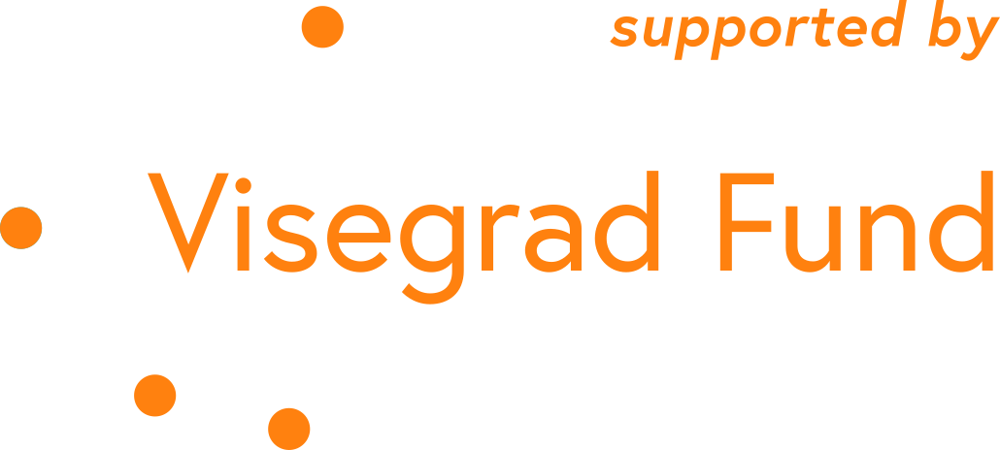

Tento workshop bude realizovaný v anglickom jazyku.

Inspired by Johnny Harris’ Vox Border’s series, this class is aimed at getting hands-on with drones and drone video footage while connecting concepts of borders, history, politics and the experiences of being human.

===

&num;BORDERS, &num;HUMANS, &num;TECHNOLOGY, AND &num;AERIAL &num;VIDEOGRAPHY

• Tutor: [Rachel Uwa](https://sensorium.is/speakers/rachel-uwa)

• 7. June - 13. June 2021

• Based in Slovakia, specific location TBA

• One week, full-time

• Small class of participants 

• Organisers: Sensorium Festival, [School of Machines, Making & Make-Believe](http://schoolofma.org)

• Co-organisers:  [Kukatko Foundation](https://www.kukatko.pl/), [Ziggurat Project - Cultural Association Platform](http://zigguratproject.com/platform), [Zlin Design Week](https://zlindesignweek.com) - [Tomas Bata University in Zlin](https://www.utb.cz/en/)

The workshop is realised thanks to the kind support of Visegrad Fund:[ www.visegradfund.org](https://www.visegradfund.org).



**How can drones and videography tell us more about our histories and ourselves?**

**Course description**

Inspired by [Johnny Harris’ Vox Border](https://www.vox.com/authors/johnny-harris)’s series, this project is aimed at getting hands-on with drones and drone video footage while connecting concepts of borders, history, politics and the experiences of being human. As you can see we have lofty goals! This course will take place in Slovakia with field trips to Slovak - Hungarian and Slovak - Czech borders in conjunction with the Sensorium Festival.

Using drones for filmmaking purposes is a relatively new area of focus often used for commercial and entertainment purposes. Drones capture a birds eyeview of the world we aren't often privy too and we'll use this to inspire our artistic interventions and storytelling throughout this one-week intensive.
This class will be a mixture of learning to navigate, film, and tell stories with flying objects while connecting with others through deep and critical discussions and collective teamwork. There will be site visits and lectures led by artists and experts as participants creatively explore mindful practices in drone and new technology usage. The programme is co-organised with cultural organisations in the V4 region. The specific choice of partner organisations in the fields of non-formal education, literature, performance and design brings together the necessary knowledge, skills and sensitivity for this programme. 

This is a very special program made up of brilliant guest instructors. The full-time course facilitator for this program will be Rachel Uwa, founder of [School of Machines, Making & Make-Believe](http://schoolofma.org).

As part of the program, workshop participants will lead a roundtable discussion at Sensorium Festival 2021 to share highlights and experiences. Additionally, there will be a micro-exhibition of works created during the program showcased during the festival.

In this course, you will be introduced to

* How to navigate and fly a drone
* How to capture video footage using a drone
* Understanding of various camera moves
* Teamwork and collaboration amongst pilot and camera operator
* Important considerations when working with drones, including what can go wrong
* Hands-on experience with DJI drones and it's safety features
* Understanding of varying kinds of drones available
* Location research and scouting for your shoot
* Preparation and storyboarding
* Knowledge of borders and history of Eastern Europe in particular Slovakia, a country sharing borders with Czech Republic, Poland, Austria, Hungary, and Ukraine as backdrop for our week-long adventure
* Meaningful discussions with others connecting concepts of borders, history, politics and the experiences of being human
* Participation in a group micro-exhibition showcasing your works as final output of the program
* An amazing network and community of like-minded creative beings and potential future collaborators

**Who is this program for?**
This program is for artists, photographers, creative directors and technologists, filmmakers, and anyone with an interest and passion in learning to work with and capture drone video footage for artistic and commercial purposes. This course approaches these topics from an introductory level. No prior experience is required.

Pricing:

Artist / Student (Full Time)* €725 until 15. Apr., €845 regular fee

Freelancer* €925 until 15. Apr., €1045 regular fee

Professional* €1125 until 15. Apr., €1265 regular fee 


