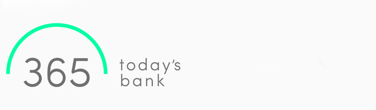

**Kapacita je obmedzená, [rezervuj si miesto na predstavenie](https://forms.gle/6CornPEVj7VdQUwU6):**

Predstavenie 1, piatok 7.6.2019 o 20:00-20:30.

Predstavenie 2, sobota 8.6.2019 o 11:00-11:30.

Predstavenie 3, sobota 8.6.2019 o 20:00-20:30.

Predstavenie 4, nedeľa 9.6.2019 o 11:00-11:30.

Predstavenie 5, nedeľa 9.6.2019 bude súčasťou komentovanej prehliadky. Registruj sa zdarma na [bit.ly/senstics](bit.ly/senstics)

Na Sensorium Festivale Cod.Act predstaví svoju fenomenálnu inštaláciu πTon. Je to nadrozmerné elastické teleso, ktoré reaguje a pohybuje sa podľa zvukov v miestnosti. Ide o nezvyčajnú zvukovú inštaláciu; predstavujúcu novú etapu výskumu Cod.Act o plastickej a zvukovej organickosti. Je výsledkom experimentu o vzťahu medzi skreslením elastickej štruktúry a syntézou ľudského hlasu v reálnom čase.

Zo surových materiálov a prírodných fyzikálnych javov, πTon pripomína organický pohyb a hlasový prejav v ich najprimitívnejších formách. Výsledkom je pozoruhodná zvuková a vizuálna udalosť, ktorá diváka posiela späť k pôvodom jeho správania.

[codact.ch](https://codact.ch/works/%CF%80ton-2/)

## Táto inštalácia je realizovaná aj vďaka podpore

Ostatní partneri sú [Pro Helvetia](https://prohelvetia.ch/) a [Bratislava Design Week](http://www.bratislavadesignweek.sk/).