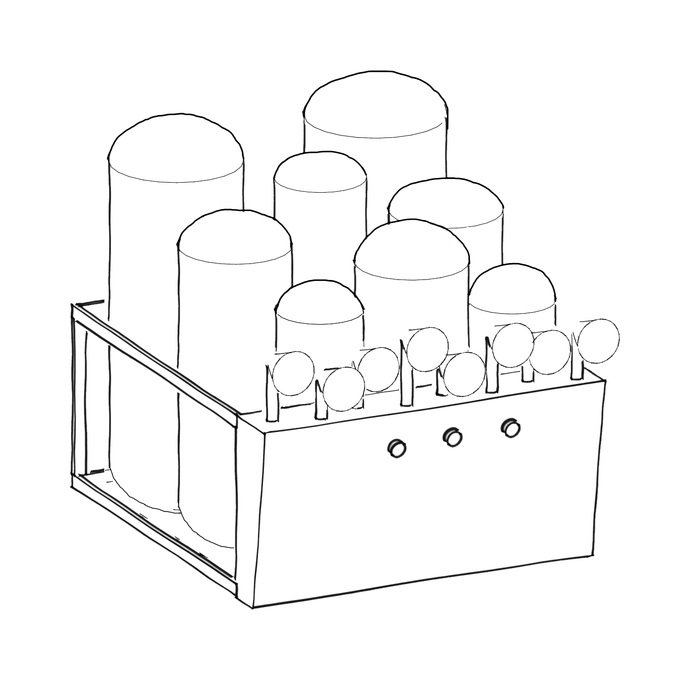

The Inflovable Machine is a playful interactive installation for all audiences, where you can experiment collectively different stages of love and share their experience. The machine would be like a brain in those different moments, when interacting, you will be the input we get in to our minds and the inflatables represent in a physical way how we process those inputs.

The interactive artwork is based in the concept of love, and it represents its three different stages, based on Helen Fisher’s research: lust, romantic love and attachment. This concept is represented by the sound output and by the interaction with the machine.

This installation was **specially commissioned** by Sensorium Festival and [Silbersalz Festival](www.silbersalz-festival.com).

[www.monicarikic.com](http://monicarikic.com)