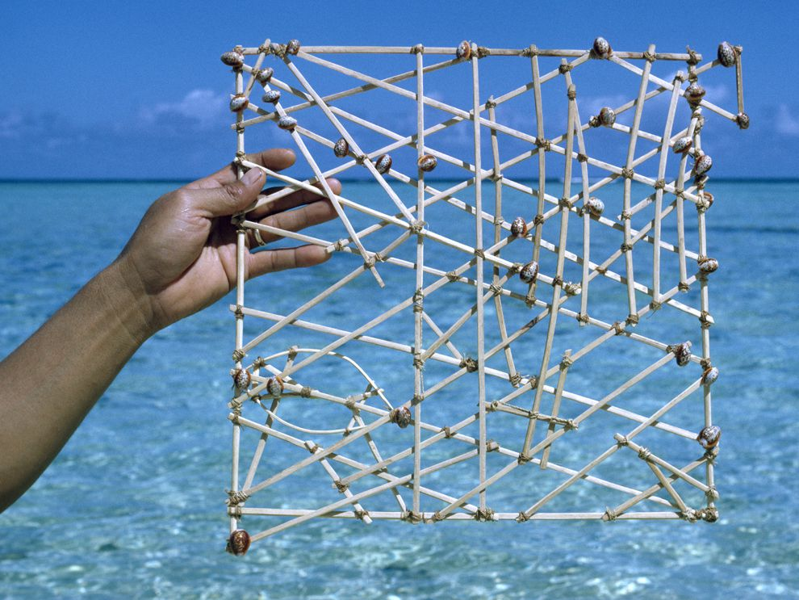

 
 

**3rd - 6th of June**  
**Bratislava, Slovakia**  
**Free of charge**  
**Curated by <a href="https://jonathanreus.com/" target="_blank">Jonathan Reus</a> &amp; <a href="https://www.sisselmarietonn.com/">Sissel Marie Tonn</a>**  
**Applications close April 15th**

<!-- NB: This URL requires escaping "_677_", otherwise markdown renders it as <em> tag -->


*With financial support of*

*In partnership with*

 

*&quot;Artists are making present and composing attention&quot;*  
— Tim Ingold, The Perception of the Environment

 

It is becoming evident that the multiple social platforms, screens and technological devices we surround ourselves with, scatter and fragment our attention. This poses a problem, since from an evolutionary perspective, our ability to attend, react and adapt to the environmental changes occurring around us, are the determining factor of our survival as a species. At present, when environmental change is the single biggest challenge for our species, how can awareness of our perceptual limitations foster new ways of creating technologies and practices for augmenting our own modes of attention? 

In this lab we will explore ways of creating technologies and practices which focus and fine-tune our attention towards sensing varied intensities of change within our environment. We will be exploring the subject by looking at qualitative methods such as ‘microphenomenology’, which is used to zoom in on the fine gradients of human experience of the world, as well as explore ways of ‘hacking’ sensory perception, through exercises and field trips within the city of Bratislava and beyond. We invite makers to come together to build new wearable/portable tools and develop sensory practices that augment the body in order to sense environmental changes, happening at the threshold of the human sensory spectrum. 

<small>Marshall Islands stick-chart: spatially conditioned memory of sensory perception, embedded into a piece of technology.</small> 
<small>Source: https://www.nationalgeographic.org/media/micronesian-stick-chart/</small>

###Participate

The Augmented Attention lab is looking for practitioners who are interested in developing technologies (in the widest sense of the word) that afford awareness and attention towards our surroundings, and who wish to engage with these issues through a collaborative making process. We look for a mix of artists, designers, musicians, neuroscientists, technologists, etc., who are willing to step out of their comfort zone, for a four-day intensive pressure cooker. The facilitators of the lab will focus on wearable sensor systems and e-textile practices as a point of departure, but we welcome all inventions/interventions that challenge the perceptual and sensory modes of the body within its environment.

Will your practice or project benefit from being part of this lab? Then **submit your entry for our open call [here](https://docs.google.com/forms/d/e/1FAIpQLScEiiC_677_-uug3VphF7YVjVwXmc_4o28FdIBzf7_hnTsmZQ/viewform), by April 15th!** The Sensorium team and lab facilitators will then select a fitting team of participants from the submissions to ensure a rich and diverse group. 

###Practicalities 

The Augmented Attention Lab will take place in Bratislava, Slovakia from the 3rd - 6th of June. Participation in the lab is free (thanks to generous support by Goethe Institut Bratislava). Note that participants need to arrange and pay their own travel to and accommodation in Bratislava. There will be digital fabrication amenities and tools available for production and prototyping on site.

The lab is part of [Sensorium Festival](https://sensorium.is): the first Slovak festival making sense of creative technology. The main Sensorium programme takes place June 7th - 9th featuring conference programme, interactive exhibition, live performances and cross-disciplinary workshops. Throughout 2019 Sensorium addresses the theme ‘The Augmented Mind’.

**The Augmented Attention Lab will culminate in an open lab session at the beginning of Sensorium Festival.** Curious visitors will be invited to look behind the scenes, test prototypes and talk to lab participants about their work.

<small>Sensory Cartographies: GSR sensor and barometric sensor body extensions, Madeira 2016</small>

###Background

This lab departs from the research-based work [Sensory Cartographies](http://jonathanreus.com/portfolio/a-sensory-cartography-of-madeira/) by Jonathan Reus and Sissel Marie Tonn. This work sprung out of conversations with Dutch anthropologist Judith van der Elst, whose work with geoinformatic technologies and indigenous cultures reveals the fact that spatial ontology is not universal across the human population, while geoinformatics tends to reify a certain western perspective on the navigation of space and geography. 

Sensory Cartographies, as such, is an ongoing research project conceiving of new wearable mapping technologies and practices that take into consideration the constant flux of change that plays out at the interface between body and the world. We are experimenting with the way mapping technologies determine the way we experience space. Informed also by research from cognitive and neuroscience, for example, in the phenomenon of ‘sensory gating’, whereby the body’s sensory system acts as a filter, singling out or amplifying events in a sea of impressions. From this point of departure we have developed prostheses/extensions and recording/playback devices that amplify or challenge the sensory system in this process of spatial and environmental dynamics. 

###Applications close April 15th

<!-- NB: This URL requires escaping "_677_", otherwise markdown renders it as <em> tag -->
