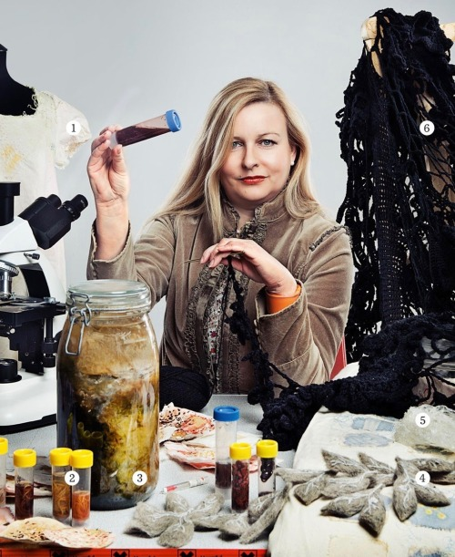
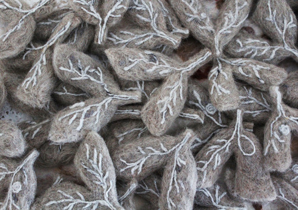
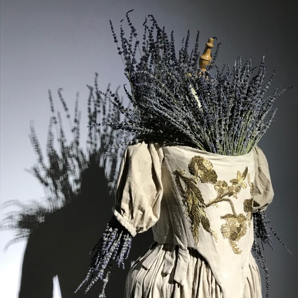
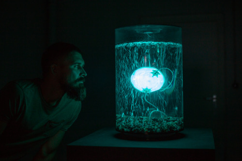

Dear friends of Sensorium,

We hope you are safe and taking care of yourself and the people around you. In these unusual and uncertain times, we believe more than ever in the importance of connection and sharing. To stay in touch in times of social distancing, to gather our ideas and to contribute what inspires us, we decided to launch a weekly format bringing voices from our community to reflect on the current pandemic situation and its potential implications. 
This is edition #1 of Stockpiling Food For Thought - the Sensorium Quarantine Weekly Special.

At the end of last year, when we chose our theme for Sensorium 2020, we did not expect how much, how soon we would need this [NEW SENSIBILITY](https://sensorium.is/new-sensibility). We do not know yet what will happen with our event, whether we will have to follow the numerous friends and partners who have had to cancel, postpone or redesign their projects due to the spread of COVID-19. (We are following very closely the evolution and will keep you updated on this topic soon.) The situation is unusual; it is also perilous. 

We fear for our health, for the health of our loved ones, for our economic situation, for the society we live in. But we also get the feeling that we are experiencing something unique, a major challenge to everything we have been used to. We feel that we need to remain attentive, stay focused, and trust that we will adapt. We need to learn new ways to connect to each other, to our environment, to our beliefs and ways of being. We need to rethink our ability to experience uncertainty. We need to develop - new sensibility. 

At Sensorium we believe in the power of you - our creative community to see beyond the obvious. The goal of this newsletter is to create a new ritual to offer thoughts, inspirations and ideas from artists, thinkers and people we admire. There will never be a shortage of food for thought, so feel free to share, or to recommend other sources of inspiration! 

***

22. 03. 2020

For this first edition, we wanted to rethink our perception of illness and question whether the pandemic itself can be inspiring. We spoke to **[Anna Dumitriu](https://www.annadumitriu.co.uk)**, a British artist whose main topic of work is the exploration of scientific, cultural and personal implications of infectious diseases. Her unique practice develops in the lab as much as in the studio, blurring the boundaries between art and science. She creates installations, interventions and performances using a range of digital, biological and traditional media including live bacteria, robotics, interactive media, and textiles. Anna’s work has been featured in major collections and museums worldwide (ZKM, Ars Electronica, BOZAR, The Picasso Museum, The V & A Museum, Philadelphia Science Center, MOCA Taipei, LABoral, Art Laboratory Berlin, the 6th Guangzhou Triennial, HeK Basel, Furtherfield London, and The Museum of the History of Science Oxford…). 

**Sensorium : Thank you, Anna, for spending some time to answer our questions! First of all, where are you spending this strange period and what is your experience of the social distancing guidelines?**

**Anna Dumitriu:** I am writing from my home on the coast of the south of England in the city of Brighton, I’m physically fine so far but trying to process what is happening, like everyone else. I’m not in self-isolation but I’m practicing social distancing when I go out for a walk or to the supermarket and making sure I stay away from others to help stop the spread of the virus. They have just officially closed the restaurants and bars which is very sad to see but important to stop the virus spreading faster. I’m not alone here, I’m with my partner, fellow artist Alex May, so I have company and we are busy making new artworks for future exhibitions and I’ll be sharing my work in progress on my social media pages.

**Sensorium : Why is it interesting for an artist to work with the topic of illness?**

**Anna Dumitriu:** I'm specifically interested in infectious disease because they are these invisible, sublime organisms that can affect us hugely and even impact societies. I always talk about how infectious diseases have had the biggest effects on humanity throughout history but I didn't expect to see it with my own eyes and live through it like this. I guess that was naive on my part.
 
 
 
**Sensorium: What is the desired impact of your work, what kind of reaction do you expect from the audience?**

**Anna Dumitriu:** I try to tell stories with my work and draw threads across time, looking at the history of healthcare and disease and the contemporary research and biotechnological approaches that are used to combat those diseases, such as whole genome sequencing and synthetic biology. I'm passionate about combating antibiotic resistance, for example in my ongoing project _**[The Romantic Disease](https://annadumitriu.tumblr.com/RomanticDisease)**_ about tuberculosis, the world's biggest infectious killer. 

I think there is so much that can be learned in looking back at the past and seeing how we dealt with infections, what mistakes were made and how they created myths about the causes and treatments of diseases. It's all still going on today in a different way - from the blaming of certain scapegoats to false advice about useless treatments.

 <small><small>_Where there’s dust there’s danger, felt lungs infected Mycobacterium tuberculosis DNA , as part of the project The Romantic Disease, by Anna Dumitriu_<small><small>

**Sensorium: What role can art play in pandemic situations like we are experiencing now? **

**Anna Dumitriu:** I find the current pandemic striking because it so clearly played out across social media and it's the first time this has happened at this level. I've been keeping an extensive collection of stories and research from the very start of the epidemic and how it has evolved and continued to evolve. Many elements have echoes in the **[diary](https://www.pepysdiary.com/)** of **Samuel Pepys** or **Daniel Defoe's** ' _**[A Journal  of the Plague Year](https://en.wikipedia.org/wiki/A_Journal_of_the_Plague_Year)**_ '. 

It's striking now also how supportive artists are to each other. Since the disease worsened in the UK I've had messages from artists and curators from all across the world (including China, Taiwan, Singapore, Germany and Austria) asking if I'm OK and telling me about their situations at home. In many places they are already emerging from the outbreaks which is somewhat comforting. 

Another important aspect is to let this situation inspire work and I am relieved that I have been able to adapt one current art commission to explore the impact of self-isolation and quarantine due to the COVID-19 Pandemic on the issue of domestic abuse and violence from a global perspective.. 
 
 
 
**Sensorium: What has been the most interesting creative reaction to the pandemic that you know of so far?**

**Anna Dumitriu:** **ZHI Art Museum** in Chengdu, China is preparing an online exhibition as a response, which they invited me to contribute to. **CAFA** (Central Academy of Fine Arts) in Beijing have already published an **[article](http://www.cafa.com.cn/en/opinions/reviews/details/8327290)** about artworks dealing with disease and healing, which features my work. 

Strangely I am also involved with my _**[Plague Dress](https://annadumitriu.tumblr.com/PlagueDress)**_ in an exhibition called _**[Infected](https://rijksmuseumboerhaave.nl/te-zien-te-doen/besmet/)**_ which is now postponed but was originally due to open in April at the **Rijksmuseum Boerhaave** (a former Pest House which also holds the microscope through which bacteria were first observed in their collection). The show was planned for a very long time and deeply researched. But I it's so unsettling, for me and the museum staff, to see just how contemporary this theme is, even though it's something we've tried to raise awareness of through our work. 

 <small><small>_The Plague Dress,  artwork by Anna Dumitriu_<small><small> 

**Sensorium: Some people say this pandemic will accelerate a wider paradigm shift in society. Do you agree? Can you describe how you see the importance and potential impact of this event on a larger scale?**

**Anna Dumitriu:** I think there will be impacts of course but it's really hard to say what they will be. Many things will go back to 'normal', others will see a 'new normal'. 

Habits form over a few weeks so I think people might get used to online meetings rather than so many business trips. Universities might do more online courses which will have a significant impact (not least on the educators). Airlines are already struggling so we don't know what will happen there but I hope the more innovative carriers survive. Recessions are anticipated of course and small businesses and freelancers will be hit, but also big businesses. Some are concerned about border closures and what that might mean for the future, though I think it's unlikely they will stay closed for longer than necessary. 

On a positive side there will be massive innovations in healthcare. The SARS-CoV-2 virus was whole genome-sequenced and human trials on a new vaccine began less than 70 days later, which is incredible. The next step is also finding an antibody test so we can see who has been infected and might be immune (as studies in Rhesus monkeys suggest). 

From an art perspective it's difficult to say. Many artists have been very affected, myself included. I've had many cancellations and postponements of events and exhibitions. That said there's been a lot of support and it even looks like there will be a repurposing of some arts funding towards supporting freelance artists. I understand the commercial art world is doing well as often happens when the stock market is uncertain. So everything remains to be seen and my thoughts are with all those affected in whatever way.

 <small><small>_Archaeabot,  artwork by Anna Dumitriu and Alex May - Image Credit: Vanessa Graf - Ars Electronica_<small><small>

***

Anna Dumitriu online:
    
    
[Web](https://www.annadumitriu.co.uk)

[Instagram](https://www.instagram.com/annadumitriuart/)

[Facebook](https://www.facebook.com/annadumitriuarts/ )

[Twitter](https://twitter.com/AnnaDumitriu)
***

Credits:

Writing: Célia Bugniot

Editing: Lucia Dubačová

Publishing: Sensorium Festival

Pictures: Courtesy of Anna Dumitriu 
