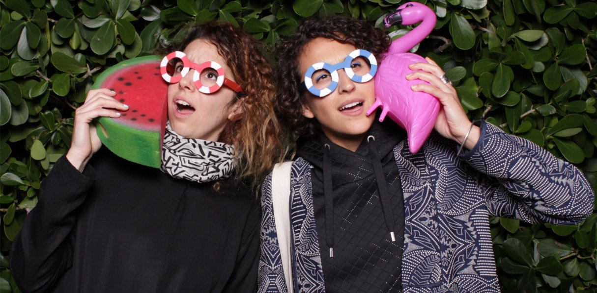
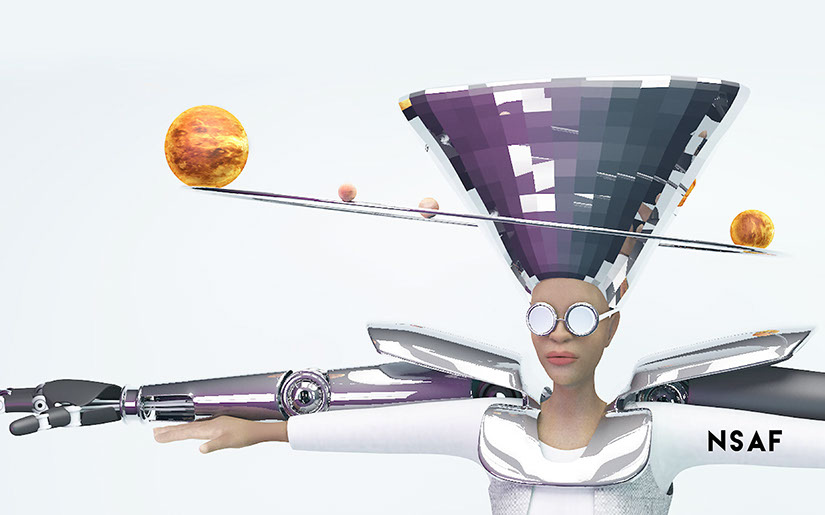
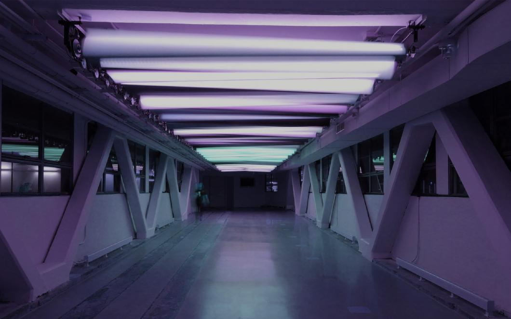
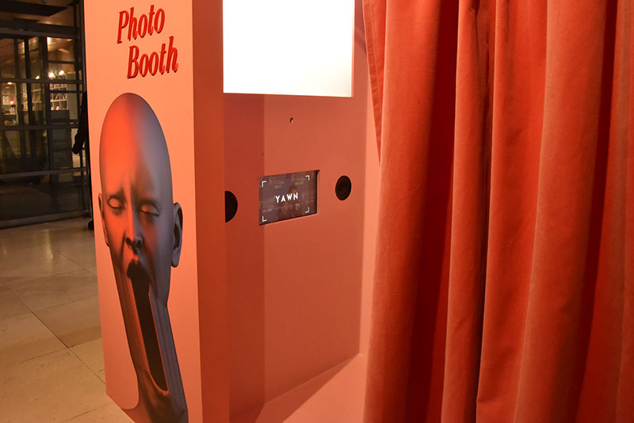
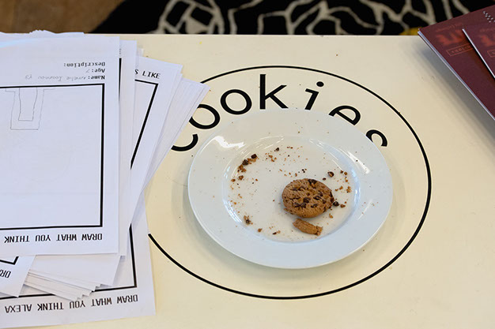

Prinášame vám 6. diel série Stockpiling Food For Thought, týždenného karanténneho špeciálu festivalu Sensorium, tentoraz s kolektívom **Hyphen Labs**.

Po viac ako dvoch mesiacoch karantény má mnoho z nás pocit, že náš život sa uberá smerom zvláštnej „novej normálnosti“. Čo však príde po nej? Udržíme si nové zvyky, alebo sa všetko vráti do pôvodných koľají? Posunieme sa natoľko, že vytvoríme novú realitu? Rozprávali sme sa s multidisciplinárnym kolektívom **Hyphen Labs** o tom, čo nás môže terajšia situácia naučiť o nás samých i celej spoločnosti.

    
***

**Hyphen Labs** je oceňovaný medzinárodný ženský kolektív so sídlom v Londýne. Projekt osciluje medzi technológiou, dizajnom, umením a futurizmom, spochybňuje konvenčné prístupy a podporuje konverzáciu. Čerpajú pritom zo širokej škály svojich záujmov od strojárstva a molekulárnej biológie po herný dizajn a architektúru. Kultivujú rezolútne globálny a multidisciplinárny prístup k skúmaniu budúcnosti, postavený na dizajne zameriavajúcom sa na planétu, a do centra pozornosti neustále sa vyvíjajúcich naratívov kladú kolektívne potreby a skúsenosti.

<small>NeuroSpeculative AfroFeminism (NeuroŠpekulatívny AfroFeminizmus) je medziplatformový projekt od Hyphen Labs a predstavuje spojenie produktového dizajnu, virtuálnej reality a neurovedy</small>

**Sensorium : Povedzte nám viac o svojej súčasnej situácii. Odkiaľ nám píšete, a ako ste sa prispôsobili súčasným podmienkam?**

**Hyphen Labs :** Všetky pracujeme z domu a nachádzame sa v Londýne. Toto je 6. týždeň nepretržitej izolácie od seba navzájom i od verejnosti. Asi 11. marca, keď sa v Európe objavovalo stále viac a viac prípadov, sme sa rozhodli prestať pracovať zo svojho štúdia. Pred vypuknutím pandémie sme pracovali na niekoľkých projektoch na objednávku, digitálnych projektoch, ako aj fyzických inštaláciách do galérií a na festivaly. Tešili sme sa na leto plné workshopov a podujatí, kde budeme môcť prednášať a vytvárať nové diela. Keď však situácia šla do tuhého, všetky podujatia, ktoré vyžadovali akúkoľvek fyzickú prítomnosť, boli presunuté alebo zrušené. Teraz sa preto venujeme rozvoju už existujúcich a nových digitálnych projektov.

Pokúšame sa tiež počas týchto dní experimentovať a učiť sa. Čas investujeme do vecí, ktoré rozvíjajú našu zvedavosť, inšpirujú nás a sú prínosné vrátane cvičenia (bicykel, joga z domu a online lekcie), čítania, varenia, hovorov na Zoome, skupinových chatov na Whatsappe, koncertov prenášaných naživo, facetimovaniu s priateľmi a rodinou, kresleniu, písaniu, pestovaniu či už jedlých rastlín alebo kvetov, počúvaniu hudby a meditovaniu. Veríme, že vďaka pravidelnej rutine, udržiavaniu komunikácie a citlivému a súcitnému správaniu sa nám podarí pandémiu prežiť bez ujmy. Chceme tiež povedať, že si mimoriadne vážime prácu všetkých kriticky dôležitých pracovníkov, slobodných rodičov, starších ľudí a pracovníkov nemocníc, ktorí sa starajú o prežitie nás i našich blízkych.  

<small>Prismatic_NYC, svetelno-kinetická socha od Hyphen Labs nad High Line v New Yorku,</small>

**Sensorium : Podnecuje súčasná situácia nejakým spôsobom váš tvorivý proces? Premýšľali ste o nových projektoch alebo nových spôsoboch prezentácie svojich projektov?**

**Hyphen Labs :** Zaujímavá otázka. Začali sme spolupracovať v roku 2014, máme zázemie v architektúre a inžinierstve, skúmali sme parametrický a výpočtový dizajn. Stretli sme sa počas magisterského štúdia. Pochádzame z úplne odlišných miest a odborov. Práve naše rozdiely nás podnietili premýšľať o tom, ako by sme mohli univerzálne komunikovať prostredníctvom digitálnych a fyzických zážitkov a priestorov. Spoluprácu sme začínali tak, že sme pracovali naprieč niekoľkými časovými pásmami, takže sme zvyknuté pracovať na diaľku. A keď sme konečne mali vlastné štúdio a boli sme všetky na tom istom mieste, uvedomili sme si význam fyzickej prítomnosti, to, že sa skutočne musíme obliecť a ísť do práce, že sa môžeme objať, smiať sa spolu, po práci si zájsť na drink a mať priestor a čas na náhodné nápady. Teraz, keď sa prispôsobujeme zmenám, stále sa stretávame na virtuálnych štúdiových raňajkách alebo večernom posedení pri drinku, počas ktorých sa snažíme nehovoriť o práci. Musíme byť flexibilné, aby sme mohli prísť na nové spôsoby práce a existencie. Pokúšame sa prísť na to, ako pokračovať vo vytváraní nových vecí, a je to podnetné.

Ak máme byť úprimné, sú dni, keď sa nám, povedzme, ťažšie sústredí a nemáme toľko motivácie. Vírus nám odhalil mnoho spoločenských nerovností. Srdcom a mysľou sme s tými, ktorí sa snažia prežiť, ktorých vyhodili z práce a prišli o príjem či zdravotné poistenie, majú podlomenú imunitu, nemôžu platiť nájom alebo nemajú doklady, zostali doma sami, izolovaní, prichádzajú o život alebo o členov rodiny, pretože sme kolektívne (ako i niektoré vlády) podcenili pandémiu, a žijeme v nefunkčnom systéme, ktorý zvýhodňuje len niektorých a prehliada ostatných. Nie sme predsa všetci ľudia?

<small>[The Gospel According to Yawn](https://vimeo.com/369876347)(Evanjelium podľa Yawna), interaktívny stánok, inštalácia, ktorú si objednal Somerset House ako reakciu na knihu[24/7: Late Capitalism and the Ends of Sleep](https://www.theguardian.com/books/2014/jul/22/24-7-late-capitalism-ends-sleep-jonathan-crary-review) (24/7: Neskorý kapitalizmus a konce spánku) od Jonathana Craryho..</small>

**Sensorium : Pracujete „na priesečníku technológie, umenia, vedy a budúcnosti“. Ako interpretujete ústrednú úlohu technológie v súčasnej kríze?**

**Hyphen Labs :** Pokiaľ ide o akúkoľvek „ústrednú úlohu“ čohokoľvek v čase krízy, na jednej strane je tu potenciál a na druhej možné úskalia. Technológia nám svojím spôsobom umožnila efektívnejšie komunikovať. Keďže sa spoločnosť presúva online, vidíme v nuansách, kto sa ako prispôsobuje. Inšpirujú nás všetky skupiny vzájomnej pomoci, ktoré sa objavili. Ľudia zdieľajú vzory na šitie, návody a videá pre domácich majstrov, ale rovnako dôležité sú aj vtipné obrázky!

Existuje však veľa nástrah. Viac ako kedykoľvek predtým sme nalepení na obrazovkách, je to forma úniku a zdroj (často mylných) informácií. Je vôbec možné absorbovať toľko informácii, a zachovávame si ich aj naozaj? Pokiaľ ide o politiku, Covid-19 slúži ako skvelá zámienka implementácie dozoru, ktorý prehlbuje „biopolitiku hromadných dát“. Tá je závislá od povrchných algoritmov, ktoré nás sledujú a informujú príslušné orgány. Ako už vieme, výsledky nebudú pre všetkých rovnaké, naopak, budú posilňovať stereotypy a ohrozovať životy. Zdedíme tak ďalší toxický systém, ktorý bude ťažké rozložiť.

<small>[Higher Resolution](https://www.tate.org.uk/whats-on/tate-modern/tate-exchange/workshop/higher-resolution), (Vyššie rozlíšenie) – výstava a seminár, ktoré kurátoroval a vytvoril kolektív Hyphen Labs v rámci programu Tate Exchange (2019). Spochybňuje naše vzťahy s digitálnymi platformami, moc technológie a spôsob, akým možno umenie použiť ako intervenčný nástroj.</small>

**Sensorium : Niektorí ľudia tvrdia, že pandémia spustí v spoločnosti širší posun paradigmy. Súhlasíte? Môžete nám popísať, aký je význam a vplyv tejto udalosti v širšom kontexte?**

**Hyphen Labs :** O tejto téme sa vedie veľa diskusií v rôznych odvetviach, think-tankoch, i našich skupinových hovoroch na Zoome i chatoch na WhatsAppe. Zdá sa, že všetci oscilujeme okolo otázky: Chceme sa vrátiť do „normálu“? 

My sa nechceme.

Je možné vyňať kúsky „normálu“, ktoré fungovali, a vybudovať si alternatívnu budúcnosť? Ktoré veci si chceme zachovať aj v budúcnosti? Kto to robí? Ako si môžeme prácu a úsilie rozdeliť a pretaviť tieto myšlienky do praxe? Kde a ako to začne?
Veľa sme diskutovali a prišli sme na mnohé dôležité poznatky. Snažili sme sa pripomenúť si, aké praktiky sú prínosné a analyzovať svoje vzťahy. Ako si vytvárame vzťahy, a ako dávame, či už sebe (osobne, v malom), komunite (lokálne) a planéte (globálne), bez toho, aby sme upadali do vývrtky pudu sebazáchovy. Každá úroveň dávania (osobná, lokálna, globálna) vyžaduje iný druh práce, a s dôrazom na sebareflexiu umožňuje individuálny rozvoj. Ak v budúcnosti dokážeme efektívne riadiť svoje vlastné ekosystémy, a dokonca povzbudiť kúsok nášho vlastného „zdivočenia sa“, či už v ľudskom alebo botanickom zmysle, získame zmysel existencie seba samých a odolnosť.

Ak máme byť konkrétnejšie, práca v malom alebo na osobnejšej úrovni, o ktorej spoločne uvažujeme, zahŕňa variácie v myslení o jednotlivých praktikách. Naša schopnosť premýšľať o „sebe“ od prechádzok po meditáciu, nám dáva šancu prehodnotiť to, čo nás v skutočnosti brzdí, ale i udržiava našu myseľ a telá v rovnováhe. Môžeme na to prichádzať sami, alebo pomocou liečiteľov či iných vhodných ľudí, prostredníctvom vzájomnej terapie alebo prácou, ktorou sa „vraciame“ do komunity.

Je nevyhnutné kolektívne sa snažiť porozumieť systémom, v ktorých žijeme, a odkloniť sa od kapitalistického spôsobu myslenia. Západné kultúry sa sústreďujú na získavanie, šetrenie a hromadenie „vecí“. Hmotné predmety nám neumožňujú pocítiť prináležitosť a nie sú pre našu existenciu podstatné. Ak sa namiesto hromadenia zásob o veci delíme, pomáha nám to posunúť naše vedomie do sfér vnímavosti a prepojenosti. 

Sme si vedomé, že sme neprišli na nič nové…, ale niekde v procese toho, ako sme si zvykali na „normálnosť“ sme boli príliš zaneprázdnené a trochu nepozorné.

Pokiaľ ide o rozoznanie bezprostrednejších zmien, bolo inšpiratívne vidieť, že krajiny, ktoré bojujú s pandémiou s najvyššou mierou úspešnosti, vedú ženy!!! Je tiež inšpiratívne vidieť, ako rozvrátené a nesprávne vedenie vedie k menšej a lokálnejšej správe.

Niektoré z kníh, ktoré by sme rady odporúčali:

* [Severance](https://www.newyorker.com/books/under-review/ling-ma-severance-captures-the-bleak-fatalistic-mood-of-2018), by Ling Ma
* [The Mushroom at the End of the World](https://www.theguardian.com/books/2017/oct/19/mushroom-end-world-anna-lowenhaupt-tsing-review), by Anna Tsing
* [Parable of the Sower](https://www.newyorker.com/books/second-read/octavia-butlers-prescient-vision-of-a-zealot-elected-to-make-america-great-again), by Octavia E. Butler 

<small>The Anxious Ocean &amp; the Moonbathers (Znepokojený oceán a Moonbathers), špekulatívna interaktívna inštalácia kolektívu Hyphen Labs, ktorá skúma budúcnosť pod človekom.</small>

**Sensorium : Aká bola zatiaľ najviac inšpirujúca či kreatívna reakcia na pandémiu, ktoré ste zatiaľ videli?**

**Hyphen Labs :** Výborná otázka! Jednou z najúžasnejších vecí bolo zažiť kreativitu na sociálnych médiách, a to od výučbových programov až po koncerty, čitateľské krúžky či kurzy tanca. Je naozaj zaujímavé vidieť, ako spoločnosť zvládla prechod domov, do online sveta. Ak to pojmeme abstraktnejšie, je zaujímavé vnímať čas novým spôsobom, najmä ako sa ohýba a plynie, čo nasvedčujú rastliny vnútri a von a slnko, ktoré oknom preniká do obydlí. Jar je v rozpuku a zdá sa, že naše nechty a vlasy absorbujú všetku energiu, ktorú produkujú naše latentné telá, a to vedie ku kolektívne strapatému vzhľadu. Osobne zažívame pomalé a zároveň rýchle tempo sveta prírody prostredníctvom nových vecí v našich životoch, ako je kváskovanie a beh. Našou doteraz najobľúbenejšou kreatívnou reakciou bolo táto [variácia úvodnej scény Avatara: Posledného vládcu vetra, kde sa predstavili i Covid 19 a Cardi-B](https://twitter.com/i/status/1241766179401797637). 

**Ďakujeme Hyphen Labs za výborné nápady, myšlienky a odporúčania!**

***

Odkazy:

[hyphen-labs.com](http://www.hyphen-labs.com/)  
[Hyphen Labs Instagram](https://www.instagram.com/hyphenlabs/)  
[Hyphen Labs facebook](https://www.facebook.com/hyphenlabsinternational/)  

***

Pripravili:  
Rozhovor viedla: Célia Bugniot  
Na otázky odpovedali: Ece Tankal, Carmen Aguilar y Wedge, Romy Gad el Rab – Hyphen Labs  
Redakcia: Lucia Dubačová  
Vydal: Sensorium Festival  
Obrázky: Courtesy of Hyphen Labs  
Preklad: Zuzana Hrivňáková  

[Predošlé rozhovory zo série „Stockpiling Food For Thought”](https://sensorium.is/#food_for_thought)
