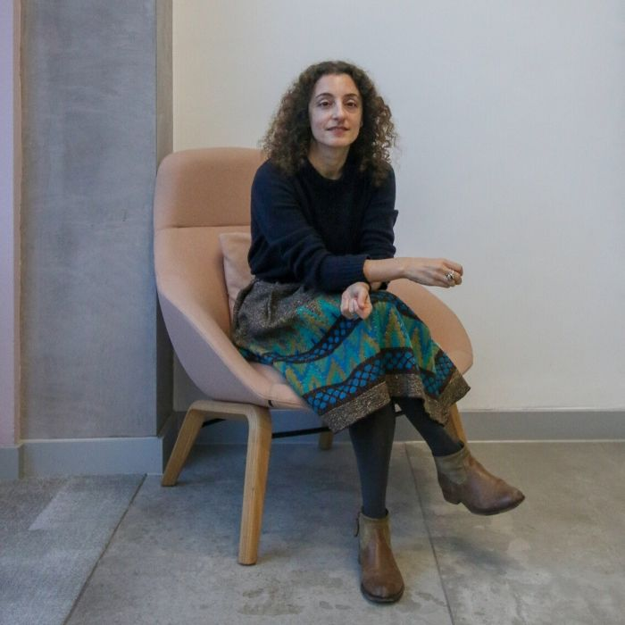
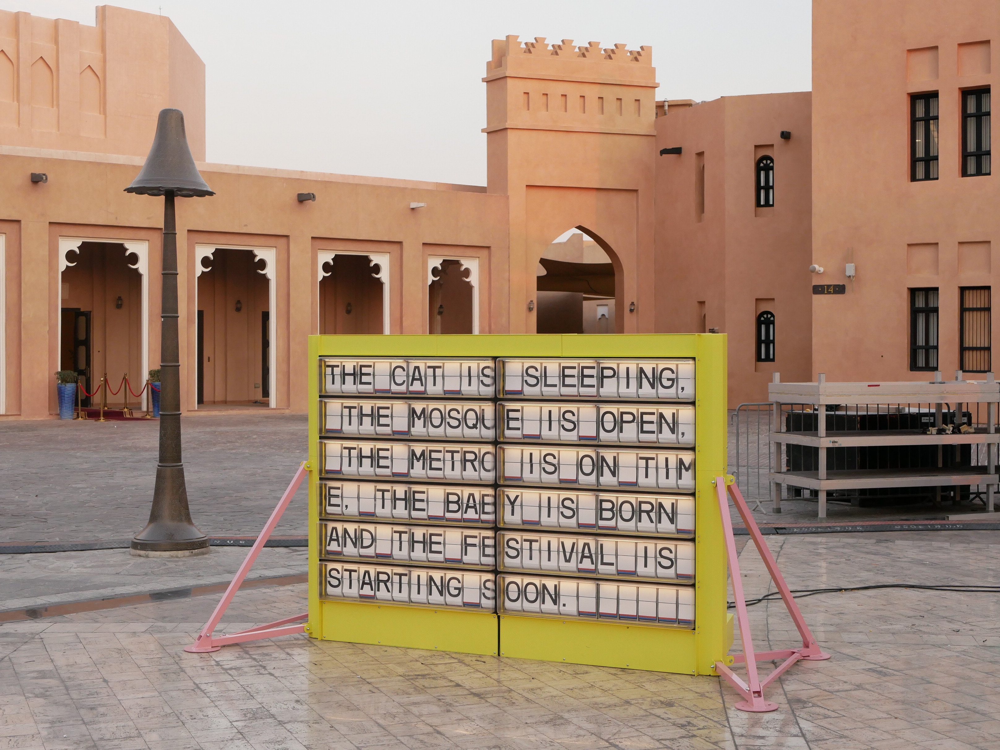
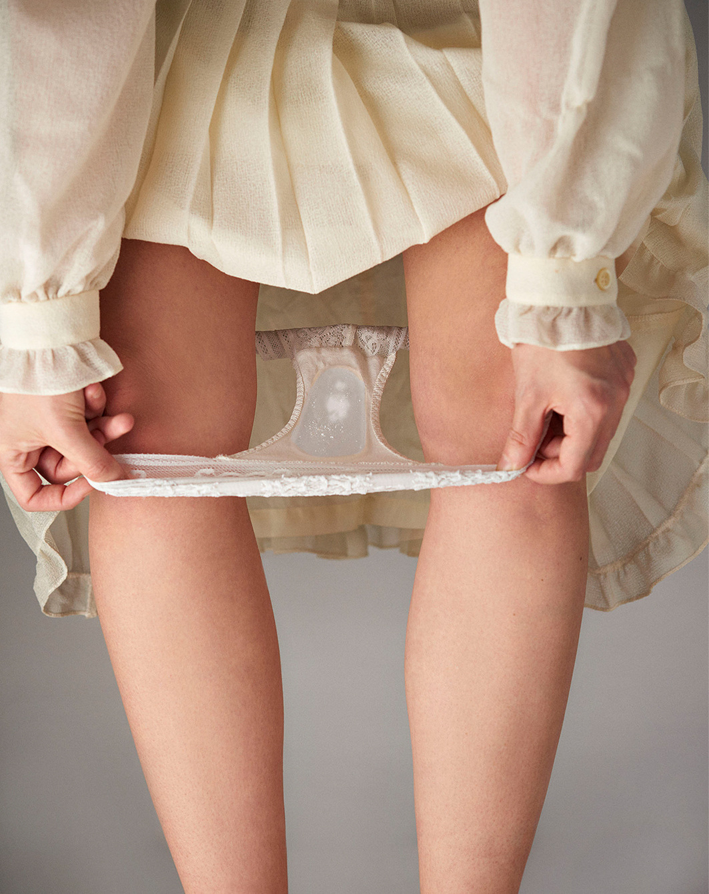

Dear friends of Sensorium,

We hope you are safe and taking care of yourself and the people around you. In these unusual and uncertain times, we believe more than ever in the importance of connection and sharing. To stay in touch in times of social distancing, to gather our ideas and to contribute what inspires us, we decided to launch a weekly format bringing voices from our community to reflect on the current pandemic situation and its potential implications. 
This is edition #2 of Stockpiling Food For Thought - the Sensorium Quarantine Weekly Special, with Irini Papadimitriou.

***

29. 03. 2020

Curators are important **agents in channeling, contextualising, enriching and disseminating** all the wonderful perspectives art and culture offers daily. We talked to our collaborator and Manchester based curator, cultural manager and **Creative Director at Future Everything**, [Irini Papadimitriou](https://futureeverything.org/people/irini-papadimitriou/) about how they are dealing with the situation in their organisation but also about the links between works of artists she has collaborated with and the pandemic. 

Irini's practice draws on interdisciplinary and critical discourse to explore the **impact of technology in society and culture**, and the role of art in helping us engage with contemporary issues. Her curatorial research areas include technology and ethics, surveillance society, digital citizenship and public (physical-digital) realm.

She currently acts as a Creative Director at [FutureEverything](https://futureeverything.org/people/irini-papadimitriou/), an innovation lab and arts organisation in Manchester, she previously worked as a **Digital Programmes Manager at the V&A** initiating and curating the annual Digital Design Weekend festival, Digital Futures and other programmes, and **Head of New Media Arts Development at Watermans**, curating the exhibitions programme.

She also has been a co-curator for the Arts & Culture experience at [Mozilla Festival ](https://www.mozillafestival.org/en/)and she is co-founder of [Maker Assembly](https://www.mozillafestival.org/en/), a critical gathering about maker culture. She is an [IWM Institute Associate](https://www.iwm.org.uk/) and has been a recipient of curatorial research programmes including [MOBIUS](https://m0bius.net/) (Finnish Institute), Art Fund, Mondriaan Fonds and British Council. She has served as a jury member for [Ars Electronica](https://ars.electronica.art/festival/en/), [Lumen Prize](https://lumenprize.com), [EU STARTS](https://lumenprize.com) and [ACM Siggraph](https://www.siggraph.org).

Her display, [Artificially Intelligent](https://www.vam.ac.uk/blog/digital/artificially-intelligent-digital-design-weekend-2018), was exhibited at the V&A in 2018.

 <small><small>_At The Moment_, Katriona Beales, Artificially Intelligent Display, V&A 2018<small><small>

    
**Sensorium: Where are you writing from, what is your situation?**
    
    
**Irini Papadimitriou:** I am writing this from home in Manchester, as we decided at FutureEverything early this week (a precaution) - (editors' note: the answers are dated 21. 03. 2020) - to start working from home. I know many people can't have this option, so we are lucky to be in a privileged position to do so. The other day I had to pop into the office we are sharing with other organisations, and it was eerily quiet, in a sort of unnerving way.
    
    
Since our team can't be in the same space at the moment, we are having daily "Breakfast club" meetings :), which is a great way to start our day, making sure we can check in and support each other at this difficult time. Having a morning check-in with the team, helps also keep focussed and plan ahead (as much as possible). We recently published on our website a [note](https://futureeverything.org/news/covid-19-update-a-note-to-our-collaborators/) to share with our collaborators and community how we are responding to the pandemic. At the moment we are looking to use our website and blog more to post articles, but also find ways to support our artists online and keep in touch with our audiences. 
    
    
We are also in full working mode and currently developing a few projects, such as Unintended Consequences, a long-term project with the National Trust at [Quarry Bank](https://www.nationaltrust.org.uk/quarry-bank) in collaboration with[ Invisible Flock](https://invisibleflock.com), and researchers at the School of Environment, Education and Development at University of Manchester. The project will be exploring the environmental impact of the industrial revolution and current challenges, but also alternative future stories. We will be announcing details about our forthcoming plans on our website soon, so stay tuned!
    

 <small><small>FutureEverything's art commission: _Every Thing Every Time_ by Naho Matsuda premiered in Doha as part of Qatar's British Festival in November 2019.<small><small>
    
    
**Sensorium: Why could it be interesting for an artist/curator to work with the topic of illness? What is the desired impact of such works, what kind of reaction do artists & curators expect from the audience?**
    
    
**Irini Papadimitriou:** Although all of us experience illness, disease, bacteria and viruses, deeper knowledge and understanding about these belongs to scientists mainly. I think artists working with science and in this case, in the field of illness, disease, bacteria or viruses can provide insightful new perspectives, but also challenge perceptions.
    
    
Artists involved with these topics can help reveal a microscopic, invisible to the naked eye world, a world that is usually inaccessible and scary for most people. The obvious things to say or see in illness, bacteria and viruses is the terrible and evil side, but through art we can understand microorganisms such as bacteria and viruses as other living things that try to survive.
    
    
While working with artist [Anna Dumitriu](https://annadumitriu.tumblr.com/), whose work I find fascinating, I learned that bacteria use chemical signals to communicate with each other, so they are a living network of microorganisms.
    
Through the work of [Giulia Tomasello](https://gitomasello.com/) I also learned more about “good” bacteria and how important these are for our bodies and health.
    
    
But to go back to the topic of disease, artists engaging with this can reveal not only medical processes, but also ethical issues, as well as the politics, financial gain and inequalities. In a crisis like the current pandemic, it becomes obvious how unjust the health system is in some places and how many people are unable to access it.
    
    
Artists can also challenge perceptions around disease. One of Anna Dumitriu’s projects that I curated for Watermans in London in 2014, was [_The Romantic Disease: An Artistic Investigation of Tuberculosis_](https://www.watermans.org.uk/new-media-arts-archive/the-romantic-disease-an-artistic-investigation-of-tuberculosis/). A brilliant long term research and investigation of historical narratives around Tuberculosis that aimed to explore and share the misconceptions, myths and superstitions around the disease. The Romantic Disease has been one of the most exciting projects to be involved with and engaged audiences in brilliant ways, through the exhibition, workshops and talks.
    

    
 <small><small>_Future Flora_ by Giulia Tomasello is a harvesting kit designed for women to treat and prevent vaginal infections. In 2018 Giulia received the Grand Prize – Artistic Exploration: Awarded for artistic exploration and art works where appropriation by the arts has a strong potential to influence or alter the use, deployment or perception of technology.<small><small>  
    
    
**Sensorium: What role can art play in pandemic situations like we are experiencing now? **

**Irini Papadimitriou:** As we have seen in the past few weeks during the pandemic crisis, art - despite the challenges - can offer us solace by creating ways to keep going and keep us together. Arts organisations, artists and art professionals have been badly affected with the majority of events having been cancelled or postponed. They have lost much needed income, but they are also in a precarious position by relying on freelance work. Affected arts organisations, from festivals to small scale museums, art centres and similar, might be unable to reopen after the pandemic. 
    
    
Despite all this, the arts community has made great efforts to bring art, design, music, theatre, film, writing, critical debates, learning, making and loads more to audiences by harnessing online platforms and other tools. This has been an extraordinary effort for keeping us connected, inspired and positive. At the same time, arts organisations, individuals and collectives have put a lot of work in sharing resources and supporting the community.  
    
    
    

**Sensorium: What has been the most interesting creative reaction to the pandemic that you know of so far?**

**Irini Papadimitriou: **People have been doing amazing stuff in order to stay connected. Thinking about the arts community, it’s brilliant to see how organisations (large or small), artists, designers, creative technologists and other art professionals are finding alternative ways and platforms to share work, resources, knowledge and coping mechanisms, but also talk to each other, create events and activities and so much more. 
    
    
The past few days I have followed the [IAM Weekend](https://www.iam-internet.com/weekend) and I love the intimacy of the online talks and discussions. It feels so much more of a community with everyone being in their space/home. I also came across a project where artists have set up some sort of a cooperative and they can sell work online for a small amount, but when they reach a certain amount of sales they also have to buy artwork from the cooperative to support other artists. It’s a great initiative. 
    
Obviously the majority of these events and actions have been online, which makes them accessible to many of us, but not everyone; we shouldn't forget that there are still many people who have no internet access.
    
    
In other cases, it’s been great to see how people try to connect with neighbours while in isolation in their homes, by singing together, or helping each other with shopping or similar. And people using different tools available to stay in touch with each other; I recently saw a birthday taking place on zoom :) and I am sure there are many more amazing examples.
    
    
    
 <small><small>_Stardust_ portrait of Irini Papadimitriou (courtesy of Sergio Albiac) from the final day of IAM Weekend with online conversations and workshops. #weareallmadeofstardust
<small><small>
    
  
    
**Sensorium: Some people say this pandemic will accelerate a wider paradigm shift in society. Do you agree? Can you describe how you see the importance and potential impact of this event on a larger scale?**

**Irini Papadimitriou:** The past few years, we have been witnessing crisis after crisis. Just to think about the more recent events e.g. from the fires in California and severe floods around the world, extended bushfires in Australia, frequent extreme weather phenomena and now the pandemic. It’s during critical events like these and the reaction of governments, politicians, corporations, companies etc that make us realise how wrong we have been doing things so far, repeating the same mistakes, but also show the selfishness, injustice and huge inequalities in our society.
    
    
During the Coronavirus pandemic it’s been really reassuring to see so many acts of kindness, but on the other hand, also worrying that such a huge number of people around the word live in extremely precarious situations without access to health, shelter and steady income. It’s also a reminder about how fragile our world is.
    
    
I have been hearing and seeing reactions from some people saying that this will also pass and we will go back to normal. I am not sure though what we mean by normal anymore. I don’t want to be pessimistic but I feel that unless we change radically how we think and act, we will only get out of this crisis to enter another one. So I very much hope that this pandemic can at least serve as a lesson for changing attitudes and hopefully avert the next crisis.
    
    
**Thank you very much Irini for sharing your thoughts and letting the Sensorium community imagine fragments of your reality.**__
    
    
***

Irini Papadimitriou & FutureEverything online:
    
    
[Web FutureEverything](https://www.futureeverything.org/)
    
[Instagram Irini Papadimitriou](https://www.instagram.com/irini_mirena/)
    
[Instagram FutureEverything](https://www.instagram.com/futureverything)

[Facebook Irini Papadimitriou](https://www.facebook.com/irinimirena.papadimitriou)
    
[Facebook FutureEverything](https://www.facebook.com/FutureEverything)
    
[Twitter Irini Papadimitriou](https://twitter.com/irini_mirena)

[Twitter FutureEverything](https://twitter.com/FuturEverything)
***

Credits:

Writing: Lucia Dubačová

Editing: Célia Bugniot

Publishing: Sensorium Festival

Pictures: Courtesy of Irini Papadimitriou, _Future Flora_ picture courtesy of Giulia Tomasello 
    
***
    
Previous editions - Stockpiling Food For Thought:
    
[Anna Dumitriu](https://sensorium.is/articles/sfft-anna-dumitriu)
