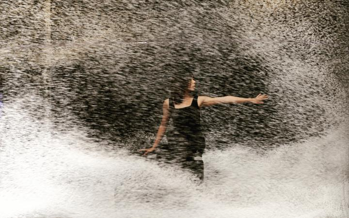
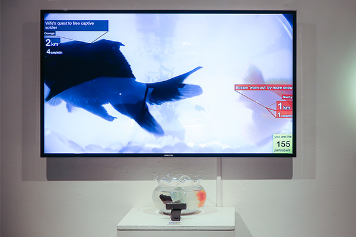
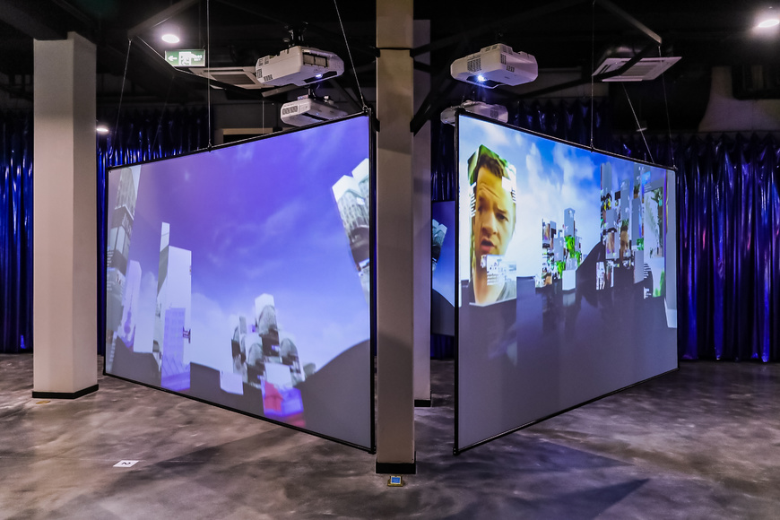
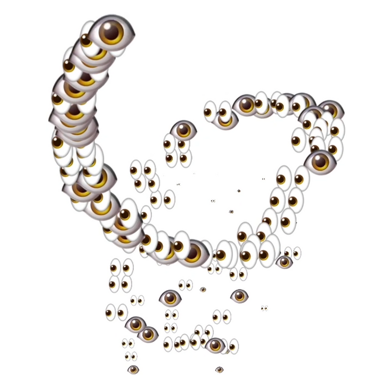
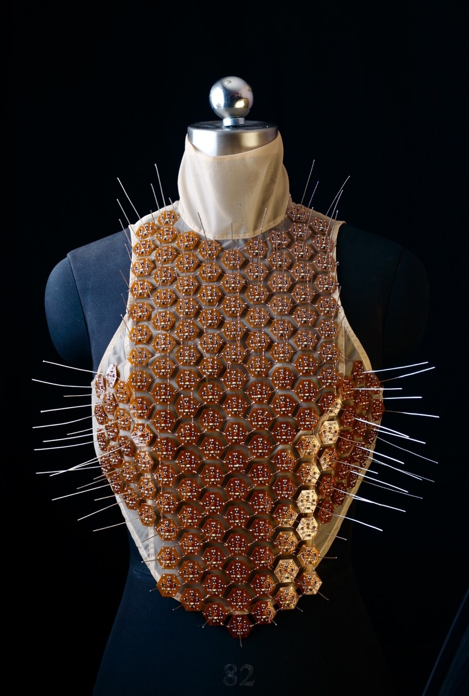
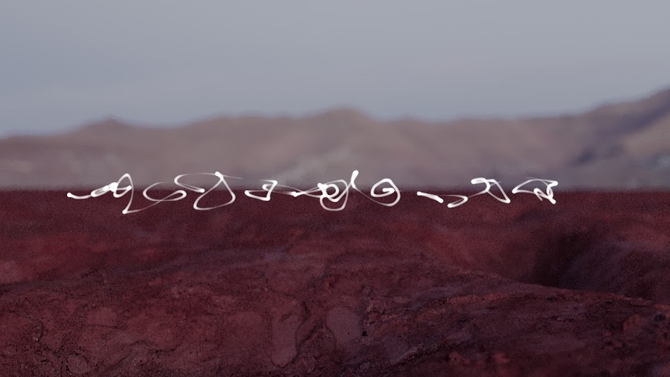

This is edition #8 of Stockpiling Food For Thought - the Sensorium Quarantine Weekly Special, with **Iris Long**.

The end of lockdown seems to be approaching in Europe and we are wondering what will happen next, especially for the arts and culture world. We looked for inspiration in a conversation with Chinese curator and researcher **Iris Long**, about how the art world in China adapted to the quarantine measures and about the potential role of digital artists in the current crisis. 

    
***

**Iris Xinru Long** is an independent curator, writer and artist, whose research focuses on how art responds to the current global reality of ubiquitous computing and big data. She currently works as a researcher on art, science and technology at [Central Academy of Fine Arts](http://www.cafa.edu.cn/en/) (Beijing, China) where she lectures on data art and artificial intelligence and co-organises [EAST - the International Conference on Education, Art, Science and Technology](http://east.work/).

Iris was shortlisted for the first M21-IAAC Award (International Awards for Art Criticism). Her translation work on [Rethinking Curating: Art after New Media](https://mitpress.mit.edu/books/rethinking-curating) received a nomination from AAC Art China awards in 2016. In 2018 she received the Hyundai Blue Prize, a curatorial award to support emerging curators. She co-curated the opening show of UN Art Center, “[The Kind Stranger](http://www.unart.org.cn/en/category/exhibition-list/detail!opening-show)” (2019) and was art jury at ISEA 2019 (International Symposium on Electronic Arts) in Korea.

Her artistic work has been exhibited internationally in venues including CAFA Art Museum (Beijing), Chronus Art Center (Shanghai), Power Station of Art (Shanghai), V2_ Institute for the Unstable Media (Rotterdam), ISEA (Hong Kong). She has been shortlisted in Prix Cube Art Prize and received an honorable mention in ifva Hong Kong.
Iris has a master degree of Critical Writing in Art and Design from the Royal College of Art, UK and a bachelor degree of Journalism and Communication from Tsinghua University, China.

<small>**Surveillance** (2014), real-time installation by **Iris Long** and **Cedar Zhou**, involving data tracking of two goldfishes in a bowl mixed with realtime news reports.
</small>

**Sensorium:  Dear Iris, thanks a lot for taking time to answer our questions. Can you describe from where you are writing, what is your situation? How did you adapt to the circumstances?**

**Iris Long:** I’m writing from Beijing. The city has just adjusted the emergency response level from I to II, which means the quarantine restrictions are loosening a bit. Until now I’ve been working from home for almost three months - delivering lectures and teaching sessions online. My curatorial projects are postponed to 2021. I’m switching  into a more introspective mode, with most of my time spent on research and writing.

<small>Non-Places by Marc Lee - part of UNArt Center’s premiere exhibition The Kind Stranger, co-curated by Iris Long
</small>

**Sensorium:  How did the art world react to the quarantine guidelines in China? Have you encountered innovative ways of communicating, diffusing and accessing artworks ? What are the perspectives now?**

**Iris Long:**  With all offline events cancelled, museums and galleries have spent a lot of energy to moving “online”, including online exhibitions, art fairs, revisiting archives and so on. Considering the social network landscape and strong “live”/broadcasting culture in this country, a lot of art professionals, including myself, are doing “live” sessions via social networking tools such as TikTok and Kuaishou, or with meeting softwares such as Zoom and Tencent Meeting. 

Notable examples include **UCCA**’s [online sonic session](https://ucca.org.cn/en/program/ucca-kuaishou-voluntary-garden-online-concert-sonic-cure/) which is an improvised concert prolonging the experience of a multimedia exhibition, or **Chronus Art Center's** “[We=Link:Ten Easy Pieces](http://www.chronusartcenter.org/en/welink-ten-easy-pieces/)” which features specially commissioned artworks to respond to the circumstances. **X Museum** in Beijing had to delay their opening so they created a [game-like online virtual exhibition](https://us.xmuseum.org/). The **Art Newspaper China** ([TANC](http://www.tanchinese.com/english/)) also hosts an online forum called “Square” on WeChat.

I curated two online programs related to my curatorial project of last winter, [Mind the Deep: Artificial Intelligence and Art](https://www.e-flux.com/announcements/296361/mind-the-deep-artificial-intelligence-and-artistic-creation/).They are called “The Hibernation Research Institute" and “Turing’s Land”. For “The Hibernation Research Institute” I invited four speakers on AI to conduct webinars via GoBrunch, and 30 researchers and artists throughout the country participated.

Another of my own responses is a co-curation with **Casey Reas** and **Carol Sabbadini** called “[a2p](https://a2p.bitmark.com/)”, for which we invited 70 artists to explore new ways of sharing and trading digital artworks: images, videos, and animations.

<small>**Protester/Eyes**, an animated GIF by artist **aaajiao**, on platform **a2p**</small>

**Sensorium: New media and digital artworks often include a reflection on contemporary issues. What can be the role of artists in such a crisis?**

**Iris Long:** I think it is a moment for us to re-think the issue of “connecting” (the opposite of isolation) and “community” - of course the underlying infrastructure for now is digitality. One notable thing I think is how digital tools are allowing a wider range of people to create and express, which is in itself a healing process. Art could heal - and the power of healing is distributed to the hands of all. 

Also, I think artists carry the mission to “archive” - through all sorts of mediums and artistic tools - not in the same way as policy makers, economists or journalists who archive facts and data, but archiving the “feeling” that we endure, something more sensible, but also significant part of collective memorising.

<small>**The Electric Skin** by **Vivian Xu**, part of the exhibition **The Kind Stranger** at **UN Art Center**, co-curated by **Iris Long**
</small>

**Sensorium: Some people say this pandemic will accelerate a wider paradigm shift in society. Do you agree? Can you describe how you see the importance and potential impact of this event on a larger scale?**

**Iris Long:** I think it makes sense. Despite the obvious facts of economic and societal uncertainties and pessimistic feelings, another important thing is a paradigm shift in our relationship to nature - one that had been simultaneously promoted and ignored. 

The pandemic has revealed the fragility of the prosperous appearances of our civilisation, and forces us to contemplate - both collectively and individually - on the most urgent issues of existence.

<small>**nimiia cétiï** by **Jenna Sutela**, audiovisual work using machine learning and bacteria to generate a new language, part of exhibition **Mind The Deep: Artificial Intelligence and Artistic Creation** at McaM Shanghai, curated by **Qiu Zhjie** and **Iris Long**
</small>

***

Links:

[https://irislong.xyz/cv](https://irislong.xyz/cv) 
[https://www.instagram.com/xingru_longiris/](https://www.instagram.com/xingru_longiris/)

***

Credits:  
Writing: Célia Bugniot  
Interviewee: Iris Long  
Editing: Lucia Dubačová  
Publishing: Sensorium Festival  
Pictures: Courtesy of Iris Long, Marc Lee, aaajiao, Vivian Xu, Jenna Sutela
