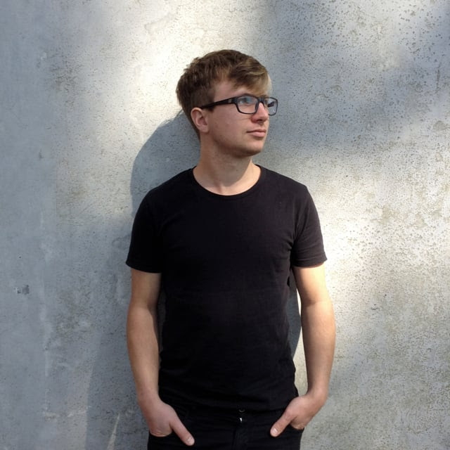
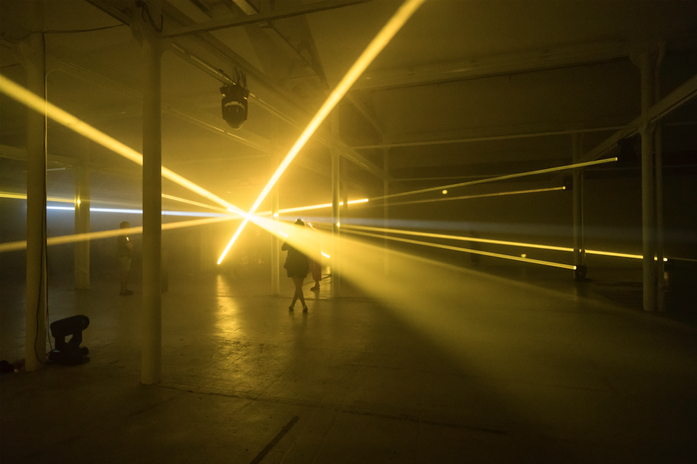

Toto je vydanie č. 3 _Stockpiling Food For Thought s Lukasom Trunigerom_ – týždenný karanténny špeciál festivalu Sensorium.

V dôsledku súčasnej krízy už môžeme pozorovať dramatický pokles znečistenia ovzdušia alebo pokles noise pollution. Situácia poukazuje na to, ako je všetko vzájomne prepojené na mikro aj makro úrovni. Umenie švajčiarskeho mediálneho umelca a hudobníka Lukasa Trunigera charakterizuje prepájanie prírodných a technologických procesov. Fascinuje ho to nehmotné, neviditeľné a komplexné, či už ide o prírodu a vznik biologických interakcií, alebo o spoločenské fenomény - ako napríklad vznik a vývoj jazykov, (umelej) inteligencie alebo ľudských infraštruktúr.

***

Zaoberá sa multimediálnymi inštaláciami, performance a tvorbou nových hudobných nástrojov. Truniger vyštudoval na Inštitúte pre hudbu a médiá (IMM) v Düsseldorfe (D) a postgraduálny diplom získal v odbore výtvarných umení na Le Fresnoy - v Tourcoingu (F). 
Na Sensorium privezie svoju jedinečnú inštaláciu Ethereal Fleeting, ktorá generuje sériu oblakov. Komplexná kovová štruktúra kontrastuje s umelo reprodukovaným prírodným javom. Formovanie oblakov je programované tak, aby v sebe nieslo algoritmickú báseň zakódovanú v umelom vetre. Vzduch sa stáva efemérnym pamäťovým médiom. 

    
    
    
**Sensorium: Odkiaľ píšeš, v akej si situácii?**
    
    
**Lukas Truniger:** Píšem z domu z Lille v severnom Francúzsku - presnejšie z mojej pivnice, kde som si kvôli karanténe spravil dočasné improvizované štúdio.

    

 <small><small>_WEthereal Fleeting_ - foto (c) Juan Soria.<small><small>
    
    
**Sensorium: Akú úlohu podľa teba môže zohrávať umenie v čase pandémie? **
    
    
**Lukas Truniger:** Vo svete, ktorý zjavne čelí naliehavejším problémom, existuje vždy určitá tenzia medzi aktuálnymi problémami a svetom umenia.
Je však dôležité pozrieť sa do seba a prehodnotiť naše konanie v týchto časoch, či už z pozície umeleckej, alebo jednoducho ako občania.
Vždy dospejem k rovnakému záveru: Je nevyhnutné, aby sme sa aj ďalej venovali umeniu, premýšľali o tom, čo sa deje, aby sme si kládli správne otázky v rámci rôznych perspektív a aby sme sa prostredníctvom našej práce podieľali na vytváraní budúcich spoločných ciest.

    

 <small><small>_Latent Realities InSitu3_ foto (c) Lukas Truniger.<small><small>  
    
    
**Sensorium: Akú najzaujímavejšiu kreatívnu reakciu na pandémiu si doposiaľ zaznamenal?**

**Lukas Truniger:** Výskumníci, tvorcovia a hackeri ponúkajú veľa zaujímavých projektov, ktoré navrhujú riešenia problémov, ku ktorým náš ekonomický systém nie je v súčasnosti schopný efektívne pristupovať. Všetky návrhy na výrobu DIY masiek, zdravotníckych pomôcok a opravy dýchacích prístrojov sú skutočne pôsobivé. Jedným z mojich obľúbených projektov v tomto rozsahu je  DP-3T - open source decentralizovaná aplikácia na sledovanie kontaktov (https://github.com/DP-3T/). Dúfam, že existuje šanca, že sa bude môcť implementovať v širšom rozsahu, pretože vlády majú stále veľké obavy z open source a decentralizovaných technológií.

Je mi sympatický fakt, že veľa ľudí skúša nové prístupy k zdieľaniu umenia virtuálne, najmä s využitím interaktívnych a všestranných možností digitálnych technológií.
    
Doteraz som síce nevidel niečo skutočne presvedčivé, ale myslím si, že časom sa z tohto vyvinú super zaujímavé nové spôsoby prežívania umenia na diaľku. Samozrejme, to nikdy nenahradí zážitky v reálnych priestoroch, so skutočnou akustikou a skutočnou prítomnosťou interpretov alebo umeleckých diel. V budúcnosti však budú vedľa tradičných foriem existovať vzrušujúce nové tekuté spôsoby, ako vystavovať alebo vnímať umenie.

    

 <small><small>_dejaEntendu_ inSitu foto (c) Lukas Truniger<small><small>   
    

**Sensorium: Niektorí ľudia tvrdia, že táto pandémia urýchli širšie zmeny v nastavení spoločnosti. Môžeš opísať svoj pohľad na význam a potenciálny vplyv tejto udalosti vo väčšom rozsahu?**

**Lukas Truniger:** Osobne ma práve teraz šokuje situácia v Európe a na celom svete. Zahltené systémy verejného zdravotníctva, uzavreté hranice, presadzovanie kontroly, nedostatok globálnej solidarity.
    
Vidím v tom veľké nebezpečenstvo pre posun paradigmy nesprávnym smerom: národný protekcionizmus, nútené sociálne (a nie fyzické) dištancovanie, autoritárstvo a rozsiahle sledovanie, ktoré sa šíria ako zámienka životaschopných metód na riešenie globálnych problémov.
Musíme hľadať skutočné inovatívne a odvážne riešenia súčasnej situácie, ako aj neustále sa rozvíjajúcich dôsledkov klimatickej krízy.
    
    
Pre mňa je toto dôležitý okamih, keď je nutné zaujať konkrétne politické postoje: za skutočnú solidaritu v našej spoločnosti, za zjednotenú a silnú Európu (napríklad s univerzálnym európskym systémom zdravotnej starostlivosti), za viac inteligentných investícií do verejného sektora, za založenie post-growth ekonomík, ako aj prerozdelenie bohatstva a zavedenie spravodlivých daňových systémov.
Ak podnikneme správne kroky, máme možnosť vytvoriť spravodlivú, pestrú, zaujímavú a inovatívnu spoločnosť a urýchliť posun paradigmy udržateľným smerom. Práve teraz však musíme byť veľmi ostražití.

 

    

 <small><small>_Membranes_ - Mex Festival - foto (c) Lukas Truniger<small><small>
    
  
    
**Sensorium: Keď sa pozrieme na biomimetiku, v ktorej sa modely prírodných procesov používajú ako vzor pre nové materiály, zariadenia a nástroje, je zrejmé, že technológia je veľmi úzko spojená s prírodnými javmi.
Niektorí ľudia vnímajú vznik nových technológií - napríklad internet vecí - ako takzvanú druhú prírodu, alebo minimálne ako dôsledok prírodnej evolúcie. Z tvojej práce sú zreteľné konkrétne prepojenia medzi technikou a prírodou. Ukazuje, ako bola technológia v skutočnosti vždy súčasťou prírody. Čo si myslíš o tejto myšlienke?**

**Lukas Truniger:** Toto je niečo, čo ma v mojej práci poháňa dopredu. Biológovia neustále zisťujú, že zručnosti kedysi považované za jedinečné ľudské, ako je použitie nástrojov, architektúra, poľnohospodárstvo alebo medicína (a teda aj používanie technológie), ale tiež iné aspekty našej kultúry, ako je komunikácia, smútok, intoxikácia alebo sexuálne potešenie, nie sú exkluzívne len ľudskou skúsenosťou.
    
    
Na druhej strane je tiež zaujímavé všimnúť si, že toto všetko objavujeme pomocou pokročilých nástrojov, ako je machine learning a data science. Možno by sme neboli schopní pochopiť prirodzený charakter technológie v kontexte prírody bez pomoci sofistikovanej technológie. Možno bolo potrebné, aby veda musela zmeniť náš pohľad z veľmi antropocentrického na niečo trochu širšie. Technológie vždy vyžadujú zmenu vnímania a zmenu perspektívy. V týchto nástrojoch existuje veľký potenciál kultúrnej introspekcie. Pretože sa snažíme napodobňovať niektoré z našich základných schopností, ako je tvorba umenia, inovácií a dizajnu s počítačmi pomocou umelej inteligencie, odrážame naše schopnosti späť cez tieto digitálne entity. Možno to pomôže vytvoriť inkluzívnejší a vzájomne prepojenejší koncept človeka v rámci prírody.

**Sensorium: Vo svojej práci skúmaš vznik rôznych systémov - či už prírodných alebo spoločenských. Všimol si si nejaké zaujímavé neobvyklé vzorce ako priamy alebo nepriamy dôsledok súčasnej krízy?**
 
    
    
**Lukas Truniger:** Keďže pandémia priniesla veľa systémových účinkov v našej spoločnosti, môžu sa prejaviť aj iné aspekty. Myslím si, že absencia mestského hluku a znečistenia má veľký vplyv na zbystrenie našich zmyslov. Osobne si oveľa viac všímam všetky rastliny a zvieratá, ktoré s nami žijú v našich mestách, teraz, keď ich môžeme lepšie počuť a vidieť.

    
_    
**Thank you very much Lukas for sharing your experience and taking the time to answer our questions.**_
    
    
    
***

Lukas Truniger online:
    
    
[Web](https://lukastruniger.net/)
    
    

[Instagram ](https://www.instagram.com/lukas.truniger/)
    

***

Kredity:

Text: Juraj Hoppan
    
Odpovede: Lukas Truniger
    
Editor: Saša Buricová
    
Vydal: Sensorium Festival
    
Fotografie: Archív Lukasa Trunigera
    

***
    
[Predošlé vydania - Stockpiling Food For Thought](https://sensorium.is/#food_for_thought)
