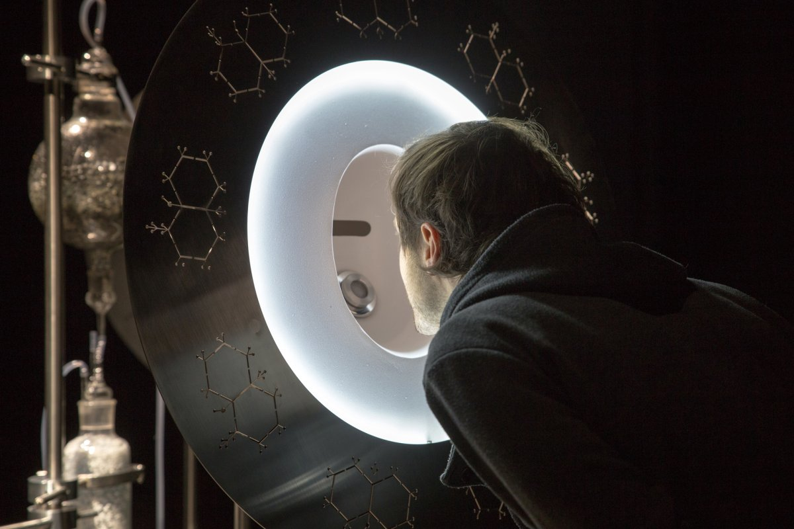

Prinášame vám 7. diel série Stockpiling Food For Thought, týždenného karanténneho špeciálu festivalu Sensorium, tentokrát so Sašou Spačalovou.
 
**Saša Spačal** nás vyzýva vnoriť sa hlboko do nenápadných vzťahov medzi „organickým, biologickým, živým“ a technologickým, do podzemných systémov podhubí až po sociálno-politické systémy a osobné dimenzie. Zamýšľa sa nad tým, ako COVID-19 zvýrazňuje prítomnosť nerovností, ale potenciálne otvára dvere aj novým predstavám o budúcnosti.
 
Saša Spačal je umelkyňa pohybujúca sa na priesečníku výskumu živých systémov, súčasného a zvukového umenia. Jej práca sa zameriava predovšetkým na posthumánne podmienky, v ktorých ľudské bytosti existujú a pôsobia ako jeden z mnohých prvkov v ekosystéme, a nie ako suverénne osoby.

    
***

**Sensorium : Odkiaľ nám píšete, aká je vaša situácia?**

**Saša Spačal:** Momentálne som v izolácii, v bezpečí a zdraví so svojou rodinou v Ľubľane. Pandémia COVID-19 ma prinútila pozastaviť ročnú umeleckú rezidenciu v Amsterdame vo Waag Society, Mediamatic a Vrije Universiteit, kde som skúmala toky podzemného podhubia a vyvíjala novú umeleckú sériu.

Moje prvé týždne izolácie, počas dobrovoľnej 14-dennej karantény, prešli vo zvláštnom zahmlenom stave neistoty a úzkosti. V mikrokozme môjho domova som sa stala ušami a očami, čítala som a počúvala, zatiaľ čo som sa obsesívne snažila zmapovať zmeny v skutočnosti, ktoré sa stali. Tento posun mal pre ľudí v Slovinsku trochu iný charakter ako v iných krajinách, pretože jeden deň po vyhlásení pandémie bola uvedená do úradu veľmi kontroverzná vláda, ktorá do veľkej miery prispela k šíreniu stresu medzi mnohými občanmi. Zrazu sme čelili bezprecedentnej situácii plnej strachu o prežitie a absolútnej nedôvery voči vláde, ktorá sa mala postarať o uzatvorenie krajiny. Počiatočná nedôvera sa, žiaľ, ukázala ako opodstatnená, pretože už v prvom týždni sa z parlamentu začali vynárať znepokojujúce príbehy. Kríza COVID-19 v Slovinsku sa stala nástrojom na sociálno-politické a hospodárske vykorisťovanie.

Počas mapovania krízy som vypozorovala niekoľko vrstiev toho, ako sa pandémia preplieta planétou: zdravotné ohrozenie biologického tela, sociálno-politickí aktéri, ktorí rozohrávajú všetko od vojnových scenárov až po empatickú starostlivosť, avšak existuje aj ticho, nehybnosť a jasnomodrá obloha. Budú mi veľmi chýbať, keď raz všetci prekonáme izoláciu.

**Sensorium : Ako môže byť téma choroby zaujímavá pre umelkyňu?  **

**Saša Spačal:** Ja osobne som tému choroby umelecky nikdy nespracúvala, no keďže sme v súčasnosti svedkami krízy COVID-19, choroba je špecifická biologická situácia, ktorá sa odráža v niekoľkých rozmeroch reality. Choroba nie je len extrémnou biologickou udalosťou pre telo, ktoré ovplyvňuje, ale vnára ho aj do hlbšieho sociálno-politického kontextu, v ktorom je choré telo prepletené a je od neho závislé. Choroba, a najmä celosvetová pandémia, má schopnosť kryštalizovať a identifikovať zraniteľné miesta v spoločnosti. Choroba vykryštalizuje situáciu a ukazuje, koľko rôznych perspektív a komunít je konkrétna spoločnosť schopná zahrnúť do svojich záchranných procesov, a ako alebo ktoré z nich zanedbá či vyslovene ignoruje.

Dúfajme, že žiadaným účinkom umeleckých diel pracujúcich s chorobou je získať vedomosti a skúsenosti s fenoménmi z rôznych hľadísk a rozšíriť oblasť porozumenia tomu, čo konkrétne ochorenie znamená, ktoré mechanizmy ho poháňajú a ktoré sú zanedbávané. Spomínam si na jedno z našich diel **Meta_bolus**. V spolupráci s mikrobiológom Mirjanom Švageljom sme skúmali, ako je vôňa vlhkých listov prepletená s históriou ľudskej rezistencie na antibiotiká, a ako konkrétne farmakologické dávky, v lekárskom žargóne nazývané bolusy, definujú vzťahy ako prospešné alebo nepriaznivé. Farmakologická nedbanlivosť v prípade antibiotík má potenciálne smrteľné následky nielen na ľudí, ale aj na pôdne baktérie Streptomyces rimosus. Tieto baktérie emitujú lákavé arómy geosmínov, ktoré môžu pripomínať vôňu lesa po daždi, a zároveň sa v globálnom meradle používajú na výrobu približne jednej tony antibiotík každých päť hodín, a to na ľudskú spotrebu, ale i na rastlinnú a živočíšnu výrobu. Takéto nadmerné využívanie baktérií Streptomyces rimosus nie je v skutočnosti potrebné. V skutočnosti to, že dochádza k nadprodukcii látky, z nej robí neúčinný liek, teda príčinou nie je neúčinnosť samotnej látky. Ako gesto vrátenia prebytku ľudského príjmu sa antibiotiká a geosmin produkované v laboratórnom prostredí inštalácie vracajú späť do pôdy a sú dostupné návštevníkom, ktorí ich môžu ovoňať čuchovými metabolickými receptormi vo forme zhromaždenia.                    

<small>Foto: Karolina Prica</small>

V budúcnosti by som rada pracovala na umeleckých dielach, ktoré by poháňali starostlivosť o ľudstvo, a tiež aj o to, čo považujem za viac ako ľudstvo – zvieratá, rastliny, mikroorganizmy, huby, a to poukazovaním na konkrétne spojenia alebo slabé miesta, ktoré sú prehliadané a zabudnuté , Niektorí ľudia hovoria, že pandémia je prvou prípravnou zaťažkávacou skúškou a po nej prídu ďalšie udalosti spôsobené klimatickou krízou. Dovolím si preto tvrdiť, že starostlivosť je veľmi dôležitý postup, ktorý musíme ako druh navzájom skúmať a ďalej rozvíjať.

**Sensorium : Akú úlohu môže hrať umenie v pandemických situáciách, aké zažívame teraz?**

**Saša Spačal:** Ľudské porozumenie sveta je vzniká produkciou významu. Umelci sú preto významnou súčasťou tohto procesu, a teda čiastočne zodpovedajú za formovanie sveta vytváraním konceptov, zmyslov, názvov a metód. To samozrejme nie je iba úloha umelcov, je to naša každodenná prax. Prostredníctvom našich diel vytvárame realitu s osobitnými etickými odpoveďami, ktoré môžu definovať životné podmienky ľudí a „viac ako ľudí“. Myslím si, že otázka pre umelcov a všetkých ostatných v čase pandémie je: aké svety chceme vytvárať a akú realitu chceme vytvárať svojimi činmi? Odpovede sú rozmanité a rôznorodé, keďže sme všetci odlišní a zďaleka nemáme rovnaký život v rôznych mikrokozmických podmienkach. S ohľadom na to som presvedčená, viac ako čas na umenie, si teraz máme hľadať čas na seba, pretože mnohí z nás musia kvôli pandemickej neistote úplne zmeniť svoj profesionálny životný štýl a vzťahy.   

**Sensorium : Niektorí ľudia hovoria, že táto pandémia urýchli širší posun paradigmy v spoločnosti. Súhlasíte? Môžete opísať, ako vidíte význam a potenciálny vplyv tejto udalosti v širšom kontexte?**

**Saša Spačal:** Pandémia určite otvára nové obzory, stále však čelíme opakujúcim sa hrozbám, ako sú násilie, chamtivosť, vykorisťovanie, rasizmus či patriarchát, ktoré sa objavujú popri vojenských metaforách používaných v politických vyhláseniach opisujúcich krízu COVID-19. Niektoré vlády si rozšírili svoje obzory a zistili, že napriek stresujúcej a neistej situácii môžu voči svojim občanom konať veľkoryso a dôrazne, v iných sa zas objavuje nárast biologického dohľadu a strata ľudských práv.

**Sensorium : Keď sa pozrieme na biomimetiku, kde sa prírodné konštrukčné prvky a procesy používajú ako modely na nové materiály, zariadenia a nástroje, je zrejmé, že technológia je veľmi úzko spojená s prírodnými fenoménmi. Niektorí ľudia vidia vznik nových technológií – napríklad internetu vecí – ako samozrejmosť, alebo skôr nie ako samočinného aktéra, ale ako prirodzený dôsledok evolúcie prírody. Vo vašej práci existuje veľmi konkrétne spojenie medzi technikou a prírodou. Pri tom som si spomenula na koncept toho, že technológia je v skutočnosti vždy súčasťou prírodných systémov. Čo si myslíte o tomto koncepte?**

**Saša Spačal:** Slová prírodný alebo prirodzený ma znervózňujú a znepokojujú. Pripomínajú diskrimináciu žien, ktoré boli príliš prírodné na to, aby boli rovnocenné s racionálnymi a osvietenými mužmi, utrpenie genderqueer populácie, ktorú považovali za neprirodzenú a ťažkosti domorodého obyvateľstva a kmeňov, ktoré boli príliš blízko k prírode a nedostatočne civilizované, považované za podradné bytosti a dokonca im upierali status živých ľudí. Keďže poznám históriu diskriminácie a utrpenia vychádzajúce z tohto slova, snažím sa ich čo najmenej využívať a nahrádzam ich pojmami organický, biologický alebo živý. Preto radšej používam živú sieť vzťahov alebo prepletení na opis veľkého množstva spojení, na ktorých sa ľudia, „viac ako ľudia“ a neživé prvky tejto planéty pohybujú a sú od nich závislí. Jedna z mojich prác, Earthlink, je systém biotechnologických zariadení, ktoré skúmajú environmentálne vzťahy v súvislosti s ľudským dýchaním..

[Video Earthlink na Vimeo](https://vimeo.com/411971525)

Ako vidíte z mojej práce, technológie, ktoré sa vyvíjajú spolu s ľudskými, živočíšnymi a rastlinnými druhmi, sú pre mňa do veľkej miery súčasťou kontinuálneho a vzájomne prepojeného kultúrneho prostredia. V týchto vzťahoch je potrebné znovu a znovu spochybňovať politiku a dôsledky technológií, pretože nie sú neutrálne, ale blízke a osobné. Ako nás Bernard Stiegler učil s externalizáciou a protetizáciou ľudského vedomia do hmoty, každá technológia so sebou nesie konkrétne vnímanie a tiež osobitnú slepotu. Metafora životného prostredia alebo planéty ako systému je jedným zo slepých miest, pretože, ako si to všimla Anna Tsingová, systém implikuje príbehy o pokroku, zakrýva zraniteľnosť, neistotu a neurčitosť, zdôrazňuje úmyselnosť a príčinnosť, čím ignoruje neplánované serendipity a nepredvídateľné stretnutia, napríklad celosvetové šírenie COVID-19.

Ďakujem za otázky a posielam pozdravy z môjho mikrokozmu do vášho!

<small>Foto: Miha Godec</small>

[Previous editions - Stockpiling Food For Thought](https://sensorium.is/#food_for_thought)
