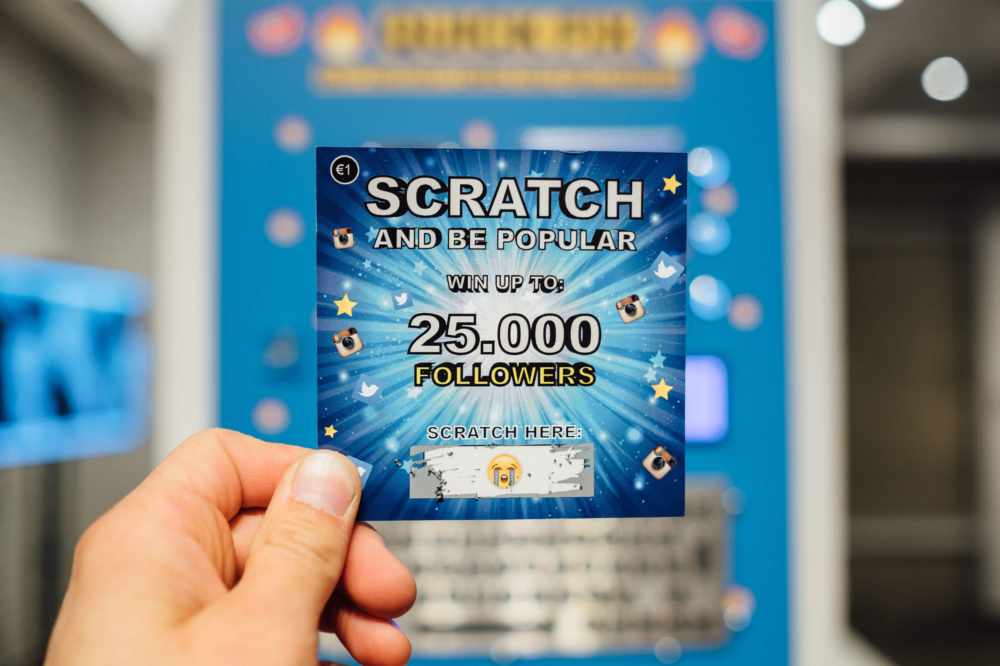
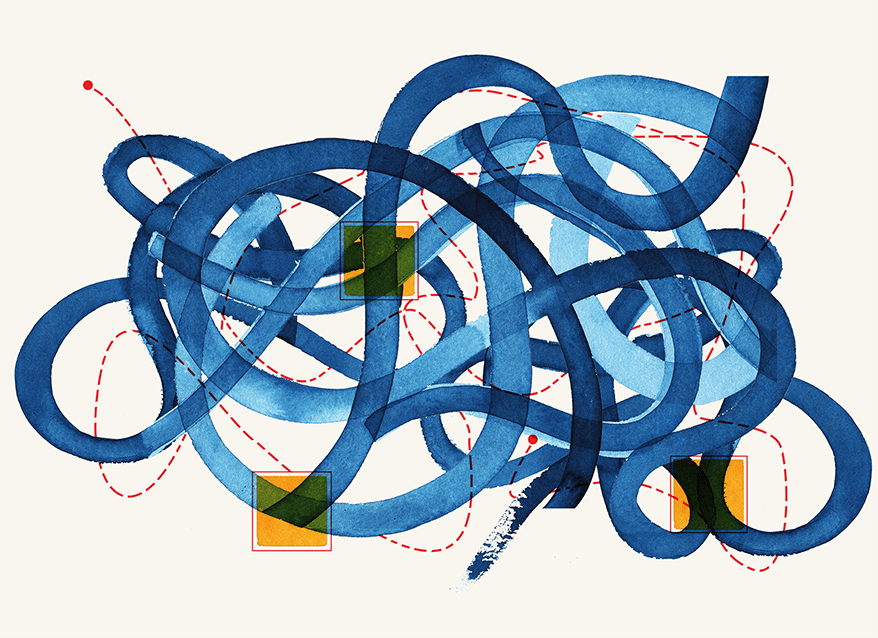
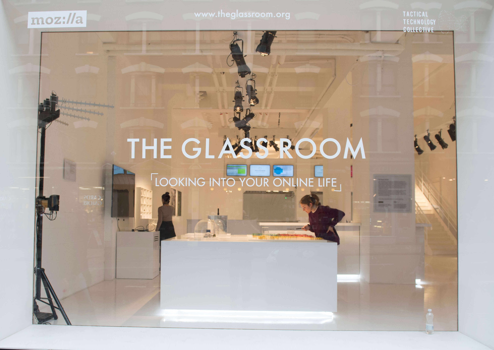
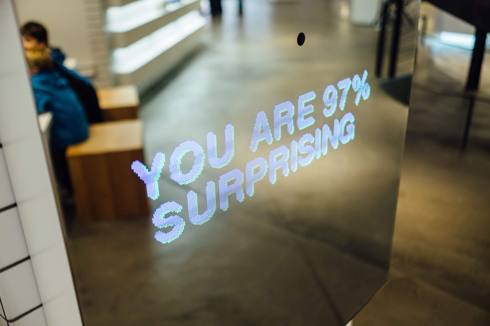

Milí priatelia,

dúfame, že ste v bezpečí a staráte sa o seba a ľudí naokolo. V týchto nezvyčajných a neistých časoch veríme viac ako kedykoľvek predtým v dôležitosť prepojenia a zdieľania. Zostaňme v kontakte aj v časoch sociálnej izolácie, aby sme nielen zhromažďovali naše nápady, ale aj prispeli k tomu, čo nás inšpiruje. Preto sme sa rozhodli sme spustiť týždenný formát, ktorý bude kanálom pre hlasy našej komunity. Budeme spoločne premýšľať o súčasnej pandemickej situácii a jej možných dôsledkoch.

Toto je vydanie č. 3 _Stockpiling Food For Thought s Daisy Kidd a Tactical Tech_ – týždenný karanténny špeciál festivalu Sensorium.

Sensorium si už od svojho vzniku dávalo za cieľ pochopiť technológie z ľudskej perspektívy. Teraz je toto poslanie ešte naliehavejšie, pretože izolácia nás núti spoliehať sa na online platformy, kde prebieha väčšina našich sociálnych interakcií, a ako riešenie na pandémiu sú nám predostierané rôzne technologicky distopické riešenia. Opýtali sme sa preto **Daisy Kidd**, koordinátorky komunikácie v [Tactical Tech](https://tacticaltech.org/#/), ako si počas krízy zachovať zdravý vzťah k technológiám.

 <small><small>Daisy Kidd, koordinátorka komunikácie v Tactical Tech.<small><small>

***

05. 04. 2020

Tactical Tech je berlínska nezisková organizácia, ktorá spolupracuje s občanmi a organizáciami občianskej spoločnosti s cieľom preskúmať a zmierniť vplyv technológií na spoločnosť.
    
    
Vo svojej práci od roku 2003 kombinujú aktivizmus, pozdvihujú povedomie a zamýšľajú sa nad vhodnými reakciami, stratégiami a taktikami ako sa nestratiť v komplexnom prostredí udržateľným spôsobom. Okrem iného vytvorili príručku [Data Detox Kit (Súprava na online detox)](https://datadetoxkit.org/fr/home), ktorá slúži na zvýšenie úrovne súkromia na webe, digitálnej bezpečnosti a používania online médií spôsobom, ktorí prispieva k duševnej pohode, a tiež aj interaktívnu výstavu [The Glass Room (Sklenená izba)](https://theglassroom.org/), v ktorej si za cieľ kládli rozprúdiť globálnu konverzáciu o informáciách a súkromí. Taktiež sa v rámci projektu [Data and Politics (Informácie a politika)](https://ourdataourselves.tacticaltech.org/projects/data-and-politics/) venujú výskumu dátovo založených politických kampaní na integritu demokratických procesov a v projekte [Exposing the Invisible (Odhaliť neviditeľné)](https://exposingtheinvisible.org/) poskytujú občanom a organizáciám občianskej spoločnosti digitálne nástroje, ktorými možno odhaliť pravdu či korupciu.

 <small><small>Objekt s názvom _„Quick Fix“_ („Rýchle riešenie“)  od Driesa Depoortera v časti _„Deeply Personal“_ („Veľmi osobné“) na dočasnej výstave The Glass Room v San Franciscu.
<small><small>

    
**Sensorium: Daisy, ďakujeme, že si si našla čas odpovedať nám na otázky. Ako súčasná situácia ovplyvňuje vašu organizáciu a pracovné podmienky?**
    
    
**Daisy Kidd:** Tactical Tech sa presunul do virtuálnej kancelárie (do našich bytov). Na niektorých projektoch môžeme bez problémov pracovať na diaľku, niektoré sme museli prispôsobiť novým podmienkam. Organizujeme veľa fyzických workshopov, verejných intervencií a rozhovorov, takže teraz hľadáme nové spôsoby, ako sa dostať k nášmu publiku, rovnako ako mnohé iné organizácie po celom svete. Pracujeme aj na nových materiáloch, ktoré sa zameriavajú priamo na problémy spojené s týmto spôsobom života, v ktorom sme závislí na technológiách.

    

 <small><small>Ilustrácia: Ann Kiernan z projektu _Exposing the Invisible_ od Tactical Tech<small><small>
    
    
**Sensorium: Nárast pandémie sa veľmi rýchlo prenášal online, v správach a na sociálnych médiách. Svetom obieha neuveriteľné množstvo pravdivých i falošných informácií. Myslíš si, že súčasné panické manévre a množstvo falošných správ hovoria niečo o našej spoločnosti a jej zraniteľnosti?**
    
    
**Daisy Kidd:** Spôsob, akým si ľudia posúvajú, konzumujú a vytvárajú informácie v online priestore je fluidný, čo nevyhnutne vedie k zníženej kontrole nad obsahom. Nanešťastie počas krízy, akou je i pandémia vírusu Covid-19 je šírienie informácii zrýchlené a časť z nich môže byť zavádzajúca alebo mylná, čo spôsobuje, že relevantné informácie týkajúce sa zdravia sa strácajú alebo prehliadajú.
    
    
Dobrou správou však je, že väčšina používateľov internetu si zvykla prijímať informácie decentralizovaným spôsobom. Mnoho ľudí dostáva najnovšie správy z rôznych zdrojov a viacerých platforiem, a vedia, že nie všetko treba považovať za nevyvrátiteľnú pravdu.
    
Všeobecne je vhodné si každú informáciu so šokujúcim či provokatívnym nábojom overiť z viacerých zdrojov. Projekt Data Detox Kit od Tactical Tech práve vydal [príručku](https://www.datadetoxkit.org/en/wellbeing/misinformation), ako sa na internete vyhnúť zavádzajúcim informáciám.

    

 <small><small>Ilustrácia: Alessandro Cripsta k projektu _Data Detox Kit_<small><small>  
    
    
**Sensorium: Smernice k sociálnemu odstupu tlačia každého do online sveta, čo výrazne zvyšuje závislosť našich aktivít a sociálnych interakcií na technológiách. Čo považuješ za riziko a čo za možnú príležitosť v rámci týchto zmien v individuálnom a kolektívnom správaní? Čo by si odporučila našim čitateľom v týchto nových časoch?**

**Daisy Kidd:** Pravdepodobne každý z nás v posledných mesiacoch pocítil moment vďačnosti za technológie. Možnosť zostať v spojení, zabávať sa a mať prístup k informáciám je mimoriadne dôležitá, najmä keď sa väčšina našich aktivít presunula do interiéru. Samozrejme sa nám určite aspoň raz stalo to, že sme na technológie mali chuť nakričať, keď nefungovali práve v momente, keď sme to potrebovali.
    
    
Tak či onak má zvýšená závislosť na technológiách horko-sladkú príchuť. Jedným z možných nebezpečenstiev, ktoré nám hrozí je, že budeme používať platformy a služby, ktoré majú nedostatočné normy na zabezpečenie súkromia či bezpečnosti. K používaniu online nástrojov počas pandémie Covid-19 vznikla skvelá [príručka](https://www.eff.org/deeplinks/2020/03/what-you-should-know-about-online-tools-during-covid-19-crisis) od [Electronic Frontier Foundation](https://www.eff.org/).
    
    
Získali sme možnosť využívať technológie kreatívnym spôsobom. Ľudia už teraz organizujú online stretnutia, hodiny tanca či vyučovanie. Pre niektorých ľudí je to nepreskúmané teritórium, vďaka ktorému môžu osloviť viac ľudí a naučiť sa nové zručnosti.
    
    
Jednoduchým, avšak dôležitým tipom je starať sa o to, aby ste sa v digitálnom priestore cítili dobre. Ak máte pocit, že trávite na internete veľa času a ste letargickí alebo si pričasto kontrolujete upozornenia, vytvorte si vlastné pravidlá či rutinu, aby ste nestratili kontrolu. [Tu](https://www.datadetoxkit.org/en/wellbeing/essentials) je niekoľko tipov, ako na to!

    

 <small><small>Návštevníci výstavy The Glass Room v Londýne.<small><small>   
    

**Sensorium: Niektorí ľudia tvrdia, že pandémia spustí v spoločnosti širší posun paradigmy. Súhlasíš? Môžeš nám popísať, aký je význam a vplyv tejto udalosti v širšom meradle?**

**Daisy Kidd:**Takýto scenár s celosvetovým dosahom bezpochyby zapríčiní širšie zmeny v spoločnosti. Niektoré z týchto zmien budú krátkodobé, iné zas dlhodobé a hlbšie zakotvené.
    
    
Už teraz vidíme rastúcu závislosť na technológiách, a bude sčasti veľmi ťažké sa jej striasť, najmä jej prínosov. Napríklad to, že sme starších príbuzných naučili, ako prijímať videohovory prinesie vyššiu digitálnu gramotnosť staršej generácie. Potom, ako sme ostali visieť doma s digitálnymi zariadeniami sa mnohí ľudia naučia, ako s nimi zaobchádzať tak, aby prispievali k celkovej duševnej pohode, spôsobom, ktorý im vyhovuje, napríklad netráviť čas pred obrazovkou večer pred spaním.
    
    
V širšom sociálnom kontexte vznikol silný pocit spoločnej komunity, ktorý vychádza z toho, že v tejto situácii sme všetci spolu a sme závislí na vzájomnej podpore. Možno niekto zaniesol nákup susedovi, s ktorým sa predtým nerozprávali alebo z balkóna zatlieskali zdravotným pracovníkom, či pozerali videá ľudí z celého sveta, pasujúcich sa s krízou vo svojom jazyku a kultúrnom priestore. Takto sa od individuálneho postoja prikláňame viac ku kolektívnemu, čo môže mať dominový efekt na spôsob našej práce, vzájomných vzťahov či to, ako hlasujeme vo voľbách.
    
    
Dôsledky epidémie na celý systém budú nedozerné. Zatiaľ čo finančný a politický systém môže schytať najhoršie následky, prínosom je, že životné prostredie si na chvíľu vydýchne od neúnavného priemyslu a výroby.

    

 <small><small>Obrázok diela s názvom „_Stealing Your Feelings“_ („Ukradnuté pocity“) od Noaha Levensona, na výstave  The Glass Room v San Franciscu.<small><small>
    
  
    
**Sensorium: Aká bola zatiaľ najviac inšpirujúca či kreatívna reakcia na pandémiu, ktorú si zatiaľ zažila?**

**Daisy Kidd:** Je ich toľko, že je to ťažké zhrnúť. Niekedy sú najlepšie tie najjednoduchšie, ako detskí autori čítajúci rozprávky pre mladých online, alebo ľudia, ktorí robia zábavné videá s vecami, ktoré doma našli. Na internete kolovalo napríklad video muža, ktorý zabehol maratón na vlastnom balkóne, čo je kreatívne a zároveň úžasne inšpirujúce!
    
    
V Nemecku, kde sídli Tactical Tech prebiehal online [hackathon](https://wirvsvirushackathon.org/?lang=en) s vyše 40 000 účastníkmi, ktorí hľadali spôsob, ako vyriešiť problémy spojené s pandémiou Covid-19. Vznikol ako iniciatívna spolkovej vlády, ktorá bude niektoré vybrané projekty financovať. Bude prebiehať i verejné hlasovanie.

    
    
***

Tactical Tech online:
    
    
[Web](https://tacticaltech.org/#/)
    
[Twitter](https://twitter.com/info_activism)
    
[Mastodon](https://mastodon.cc/@info_activism/)

[Facebook](https://www.facebook.com/Tactical.Tech/)
    

***

Text: Célia Bugniot
    
Odpovede: Daisy Kidd, Tactical Tech    

Editor: Lucia Dubačová

Vydal: Sensorium Festival

Obrázky: Courtesy of Tactical Tech 
    
***
    
[Predošlé vydania - Stockpiling Food For Thought](https://sensorium.is/#food_for_thought)
